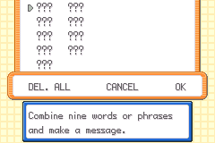
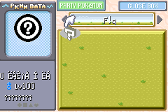

In this route, you will be setting up arbitrary code execution in non-Japanese FireRed or LeafGreen through the PC shift/swap action in the Pokémon Storage System. Through the mail glitch, you will transform an empty slot in the PC into glitch species 0x0351 which is the standard ACE species used in non-Japanese FireRed and LeafGreen.

## Prequisites

*   Your save has the mail glitch active, and you know how to use it.
    +   If not, please read [this article](mail-glitch.md) to learn how to activate it.
*   8 HP Ups
    +   These can be purchased or cloned via the mail glitch.

## Procedure

Make sure that Box 3, Slot 1 is **empty** before you do this.

Then activate the mail glitch, you should see the following screen

<figure markdown="span">


<figcaption markdown="span">

The glitched mail on English FireRed and LeafGreen.

</figcaption>

</figure>

**Set** the message of the glitched mail to be the following.

<table>
    <tbody>
        <tr>
            <th scope="row">English</th>
            <td>
                <table>
                    <tbody>
                        <tr>
                            <td>???</td>
                            <td>HIGHS</td>
                        </tr>
                        <tr>
                            <td>I CHOOSE YOU</td>
                            <td>WANDERING</td>
                        </tr>
                    </tbody>
                </table>
            </td>
        </tr>
        <tr>
            <th scope="row">French</th>
            <td>
                <table>
                    <tbody>
                        <tr>
                            <td>???</td>
                            <td>HAUTEUR</td>
                        </tr>
                        <tr>
                            <td>CE SERA TOI</td>
                            <td>NOMADE</td>
                        </tr>
                    </tbody>
                </table>
            </td>
        </tr>
        <tr>
            <th scope="row">Italian</th>
            <td>
                <table>
                    <tbody>
                        <tr>
                            <td>???</td>
                            <td>SUL SERIO</td>
                        </tr>
                        <tr>
                            <td>FATTI AVANTI</td>
                            <td>CRUDELE</td>
                        </tr>
                    </tbody>
                </table>
            </td>
        </tr>
        <tr>
            <th scope="row">German</th>
            <td>
                <table>
                    <tbody>
                        <tr>
                            <td>???</td>
                            <td>HÖHEN</td>
                        </tr>
                        <tr>
                            <td>DU BIST DRAN</td>
                            <td>LATSCH</td>
                        </tr>
                    </tbody>
                </table>
            </td>
        </tr>
        <tr>
            <th scope="row">Spanish</th>
            <td>
                <table>
                    <tbody>
                        <tr>
                            <td>(?)</td>
                            <td>INFANTIL</td>
                        </tr>
                        <tr>
                            <td>TE ELIJO</td>
                            <td>RIDÍCULO</td>
                        </tr>
                    </tbody>
                </table>
            </td>
        </tr>
    </tbody>
</table>

**Confirm** the message.

After confirming the message, a glitch species should appear in Box 3, Slot 1. This should be glitch species 0x0200. It should have the following characteristics:

*   Species name is one of the following depending on your language:
    <table>
        <tbody>
            <tr>
                <th scope="row">English</th>
                <td><samp>HOCK</samp></td>
            </tr>
            <tr>
                <th scope="row">French</th>
                <td><samp style="white-space: pre">     TONNE</samp></td>
            </tr>
            <tr>
                <th scope="row">Italian</th>
                <td><samp>CK</samp></td>
            </tr>
            <tr>
                <th scope="row">German</th>
                <td><samp>HOCK</samp></td>
            </tr>
            <tr>
                <th scope="row">Spanish</th>
                <td><samp>ENO</samp></td>
            </tr>
        </tbody>
    </table>
*   Level 4
*   Female

If the glitch species does not have the correct name, or a bad egg appeared instead, do the glitched mail message again, and make sure that Box 3, Slot 1 is **empty**.

Move glitch species 0x0200 into your party then give it:

*   **8** HP Ups
    +   This provides **80** HP effort values.
*   **1** **HP** effort value
    +   This can be provided by Caterpie, which can be found in the Viridian Forest.
*   **1** **Attack** effort value
    +   This can be provided by defeating **1** Doduo, which can be found on Route 16.
    +   This can also be provided by defeating **1** Mankey, which can be found on Route 22.

After giving it these EVs, place it back into Box 3, Slot 1.

Activate the mail glitch again, then set the message of the glitched mail to be the following:

<div class="admonition note" markdown="block">
<p class="admonition-title">Note</p>

You will see the message that you have entered in the first glitched mail. This is completely normal, and is intended.

The words entered for this message are the same, but the position of the second and fourth words have been swapped. You do not need to re-enter the first or third words.

</div>

<table>
    <tbody>
        <tr>
            <th scope="row">English</th>
            <td>
                <table>
                    <tbody>
                        <tr>
                            <td>???</td>
                            <td>WANDERING</td>
                        </tr>
                        <tr>
                            <td>I CHOOSE YOU</td>
                            <td>HIGHS</td>
                        </tr>
                    </tbody>
                </table>
            </td>
        </tr>
        <tr>
            <th scope="row">French</th>
            <td>
                <table>
                    <tbody>
                        <tr>
                            <td>???</td>
                            <td>NOMADE</td>
                        </tr>
                        <tr>
                            <td>CE SERA TOI</td>
                            <td>HAUTEUR</td>
                        </tr>
                    </tbody>
                </table>
            </td>
        </tr>
        <tr>
            <th scope="row">Italian</th>
            <td>
                <table>
                    <tbody>
                        <tr>
                            <td>???</td>
                            <td>CRUDELE</td>
                        </tr>
                        <tr>
                            <td>FATTI AVANTI</td>
                            <td>SUL SERIO</td>
                        </tr>
                    </tbody>
                </table>
            </td>
        </tr>
        <tr>
            <th scope="row">German</th>
            <td>
                <table>
                    <tbody>
                        <tr>
                            <td>???</td>
                            <td>LATSCH</td>
                        </tr>
                        <tr>
                            <td>DU BIST DRAN</td>
                            <td>HÖHEN</td>
                        </tr>
                    </tbody>
                </table>
            </td>
        </tr>
        <tr>
            <th scope="row">Spanish</th>
            <td>
                <table>
                    <tbody>
                        <tr>
                            <td>(?)</td>
                            <td>RIDÍCULO</td>
                        </tr>
                        <tr>
                            <td>TE ELIJO</td>
                            <td>INFANTIL</td>
                        </tr>
                    </tbody>
                </table>
            </td>
        </tr>
    </tbody>
</table>

**Confirm** the message.

After confirming this message, check Box 3, Slot 1. The 0x0200 should have become glitch species 0x0351, which should have a name like <samp>ËÁÈî ΠËÁ</samp>, level 100, and is male as shown in the image below. This is your ACE Pokémon. If you see this, that means you have successfully setup ACE! Continue reading to learn how to trigger ACE with this Pokémon.



## Appendix

### How to trigger ACE

<div class="admonition note" markdown="block">
<p class="admonition-title">Note</p>

Before triggering any kind of ACE, make sure that:

*   Done all prerequisite steps for that particular code (e.g. created specific bootstraps, in correct location, etc.)
*   You have changed the box names to the ones for your code. Make sure that you have entered these codes correctly!
*   The entrypoint (Box 13, Slot 7) and all spaces after it are **empty**.
    +   If the Pokémon occupying these spaces are bootstrap Pokémon (Pokémon containing special data for various ACE setups to use), they should be fine occupying these spaces as long as they are for the form of ACE you are using (the covered form in this tutorial is **grab/swap** ACE).

</div>

Make sure you are in the PC’s **Move Pokémon** mode.

Then switch the selection mode to **Relocate Mode** by pressing <kbd>SELECT</kbd>, the cursor should have changed to an orange colour indicating that the current mode is **Relocate Mode**.

In Relocate mode, move the cursor over to any Pokémon then grab by pressing <kbd>A</kbd>.

Move the cursor over to the glitch Pokémon if any other Pokémon was initially grabbed, or any other Pokémon if the glitch Pokémon was initially grabbed.

Then swap these two Pokémon by pressing <kbd>A</kbd>. Then swap again.

You can place the Pokémon anywhere else afterwards.

An image below has been provided to illustrate how it should look.


### Checking if everything worked

Make sure that Box 9, Slot 30 is **empty**, then set your box names to the ones shown below.

```
Box  1:	C C U n n R E o	[CCUnnREo]
Box  2:	P R o / G w m  	[PRo/Gwm]   (change '/' to 'B' for inaccurate emulators)
Box  3:	A A T S , m    	[AATS,m]
Box  4:	A / F Q m      	[A/FQm]
Box  5:	D F Q m        	[DFQm]
Box  6:	_ V o H I C o r	[ VoHICor]
Box  7:	B n            	[Bn]
Box 8+:	(anything)
```

Then trigger ACE. Then enter the PC, and look at Box 9, a shiny, level 0, female Bulbasaur should have appeared in slot 30. That means the ACE is working properly. You can safely delete this Bulbasaur after doing this code.

### Technical details

First, with the first glitched mail, the encryption key[^1] for the “Pokémon” in the empty slot is changed from 0 to 0x3E000200, which will cause the empty slot’s data to be interpreted as a glitch Pokémon (glitch species 0x200) instead. The reason why this particular corruption is not interpreted as a bad egg is because the data in the empty slot (which is now 0x0200 × 12 + 0x3E00 × 12), adds up to a 16-bit value of 0 (this game’s code uses wrapping unsigned 16-bit arithmetic for the checksum), which is the same as the initial checksum of 0, thus its seen as valid Pokémon data. For the rest of this explanation (and for brevity), this glitch species will be called HOCK.

We prepare HOCK for the second (and final) glitched mail, which modifies the PID to read the EVs substructure as the Growth substructure. From the new encryption key, HOCK already has two Attack EVs, so we only need to give it an extra Attack EV and 81 HP EVs, totalling to 81 HP EVs and 3 Attack EVs. With the next glitched mail, these will be read as the species index and they will combine (they are combined with this calculation: <var>hpEV</var> + <var>attackEV</var> × 256) to form species index 0x0351 which corresponds to glitch species 0x0351.[^2] This mail simply swaps the values of the PID high (upper 16 bits), and the SID of HOCK which keeps the same encryption key but changes the substructure order.

After entering the glitched mail, we are left with glitch species 0x0351 with no nickname.

Below shows what is happening to the PID, TID, SID, encryption key, as well as the substructure order (shown in the parentheses after the corresponding PID) during the process of turning an empty slot into glitch species 0x0351.

Personality value

:   0x00000000 (GAEM) → 0x1E000000 (GAEM) → 0x20000000 (AEGM)

Trainer ID (TID)

:   0 (0x0000) → 512 (0x0200) → 512 (0x0200)

Secret ID (SID)

:   0 → 8192 (0x2000) → 7680 (0x1E00)

Encryption key

:   0x00000000 → 0x3E000200 → 0x3E000200

[^1]: The encryption key is formed by this calculation: <var>PID</var> &oplus; (<var>TID</var> + <var>SID</var> &times; 65536)
[^2]: You can read more at the provided link (courtesy of Bulbapedia) on how the data substructures are arranged and what is stored in each one. <https://bulbapedia.bulbagarden.net/wiki/Pok%C3%A9mon_data_substructures_(Generation_III)>

## Credits

*   gifvex and the Pokémon speedrunning community for discovering the ability to corrupt empty slots into glitch Pokémon with the mail glitch.
*   Papa Jefé for confirming that this route works on other languages.
