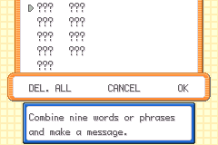
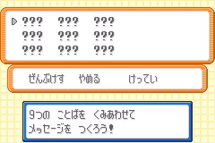
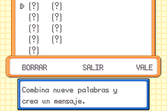

<details class="admonition info" markdown="block">
<summary class="admonition-title">Terminology changes</summary>

Historically, this used the following definitions regarding <b>Mail glitch</b>:

Preparing the Mail glitch

:   This was used for the step that removes Mail using Knock Off and Recycle, which is known as the [<dfn>Mail removal glitch</dfn>](https://glitchcity.wiki/wiki/Mail_removal_glitch), or <dfn>Mail glitch</dfn> for short.
    The Mail glitch will now be the name for this step.
    The section for this will also be renamed to <i>Triggering the Mail glitch</i>.

Mail glitch

:   This was used for the glitched Mail entry screen.
    Now the article will refer to this as the <dfn>question mark Mail</dfn> (<abbr>QMM</abbr>).

These changes were made to align more with uses of the term within the Ruby and Sapphire speedrunning community which have always used these names for these parts of what was called the Mail glitch before this website existed.
This should also make discourse surrounding the Mail glitch more clear, with the Mail removal and the item duplication/data corruption parts having their own distinct naming.

Apologies for any inconveniences caused by renaming.

</details>

The <b>Mail glitch</b> is a glitch that allows you to remove Mail from a Pokémon in an unintended way.
This puts the save’s Mail data into a glitched state, the player can use this glitched state to access a 7th[^1] party Mail data slot, which is known as the <dfn>question mark Mail</dfn> (<abbr>QMM</abbr>).
This Mail has weird properties that allow you to write data to a box slot in the PC using the words of the Mail, and also allows you to duplicate items.

The purpose of this tutorial is to trigger the Mail glitch on the save so that we can access the question mark Mail.

[^1]:
    This 7th Mail data slot is not internally the actual 7th Mail data slot in the game (that would in the PC mailbox).
    Instead what the Mail slot the game accesses when it tries to use a 7th Mail data slot is (most of the time) the 256th Mail data slot.
    Sometimes the Mail data slot accessed can also be the 1st to 6th Mail data slots (those of the party),
    if the Pokémon got its Mail removed through the Mail glitch prior to receiving the Mail.
    It gets these destinations from the Mail ID byte in the Pokémon’s data,
    which stores the zero-indexed identifier for the Mail data slot of the Pokémon’s held Mail.
    This is normally 0xFF (256th slot) when not holding a Mail,
    or 0x00 (1st) to 0x05 (6th) when holding a Mail.

## Requirements

*   A Pokémon with the move <b>Knock Off</b>.
    +   CH’DING the trade Farfetch’d learns <b>Knock Off</b> at level <b>21</b>.
*   A Pokémon with the move <b>Recycle</b>.
    +   MIMIEN the trade Mr. Mime learns Recycle at level <b>33</b>.
    +   Porygon learns Recycle at level <b>44</b>.
*   A consumable item (e.g. a berry).
    +   A Sitrus Berry works best as its consumption will trigger at 50% HP.
*   Mail
    +   The only Mail that is purchasable in FireRed and LeafGreen is <b>Retro Mail</b>, and those cost 50 Pokédollars.
    +   You should buy this in large amounts, preferably at least <b>one hundred</b>.

## Triggering the Mail glitch

Order the Pokémon in your party as follows:

1. Any Pokémon holding a consumable item.
2. Your Pokémon that knows <b>Knock Off</b>.
3. Your Pokémon that knows <b>Recycle</b>. This Pokémon must be holding <b>Mail</b>, the message on it does not matter.

Then move your player character close to any Double Battle trainers.
If you have not battled the Double Battle trainers at this point, then make sure to not be within their sightline.
Save your game at this point, before performing the next step.

Start a Double Battle with the trainers.

<div class="admonition note" markdown="block">
<p class="admonition-title">Note</p>

If you are planning on obtaining species 0x0351 via corrupting MIMIEN, keep in mind that MIMIEN will gain EVs during this battle if it gains any experience points.
For this case, the double battle against Rapidash and Ninetales on Route 16 is preferred.
They only give Speed and Sp.Defense EVs which will not affect MIMIEN’s conversion into 0x0351.

</div>

In the Double Battle, you will need to do the following actions:

1. Trigger the Pokémon’s consumption of the consumable item.
2. Once the Pokémon consumed its held item, shift the Pokémon holding Mail into its place.
3. At the same time, use Knock Off on the incoming Pokémon. The Pokémon should have its Mail knocked off when it enters the battle.
4. On the next turn, use Recycle. The Pokémon should find the consumable item.
5. Finish the Double Battle.

When viewing your party, there should be **no** Pokémon holding a **mail** item. If that is the case, then you have successfully triggered the Mail glitch. Otherwise, you should restart back from your previous save point and try this procedure again.

## Using the question mark Mail

<div class="admonition note" markdown="block">
<p class="admonition-title">Note</p>

These instructions assume you have triggered the Mail glitch once on your save.
Triggering the Mail glitch multiple times will cause the question mark Mail to appear earlier than indicated in the instructions.

</div>

The question mark Mail writes to Box 3, Slot 1 in the PC.
If you want to modify a Pokémon using the <abbr title="question mark Mail">QMM</abbr>, place a Pokémon in that slot.
Otherwise, keep it empty.

First, make sure that you have 6 Pokémon in your party.
What the 6 Pokémon are does not matter.
Give each Pokémon a Mail, these Mails can contain any message.

When giving Mail to the 6th[^2] Pokémon, the contents should look *different*.
This is the question mark Mail.
This Mail should already have a message entered with <samp>???</samp> or <samp>(?)</samp> words as shown in the below pictures.
If Box 3, Slot 1 is occupied with a Pokémon, you might see random phrases instead, this is normal.

[^2]:
    If you triggered the Mail glitch multiple times, the question mark Mail will appear earlier.
    Subtract the number of Mail glitch triggers done on the save from 7 and that will be the number of Pokémon in the party needed for making the question mark Mail appear.

In some cases, **even with a fully empty Box 3, Slot 1**, you might not see the <samp>???</samp> or <samp>(?)</samp> words, rather a message that was entered on a Mail previously given to the Pokémon.
This might happen if the Pokémon being given the Mail previously got its Mail removed through the Mail glitch.
This can be fixed by depositing the Pokémon into the PC and then withdrawing it.[^3]

[^3]:
    This resets the Mail ID byte of the Pokémon to its default value (0xFF), which is used to keep track of the Mail data of its held Mail.
    Normally this is cleared when taking Mail through the normal party list interface, however, the Mail glitch does not clear this!
    The Pokémon corruption abilities of the question mark Mail relies on the value of the Mail ID byte being 0xFF (or some other high value, but this one is the only one that is accessible in normal gameplay) which directs which slot to write Mail data to, in this case to the 256th Mail data slot.

<div class="grid" markdown="block">
<figure markdown="span">


<figcaption markdown="span">

The glitched mail on English FireRed and LeafGreen.

</figcaption>

</figure>
<figure markdown="span">


<figcaption markdown="span">

The glitched mail on Japanese FireRed and LeafGreen.

</figcaption>

<figure markdown="span">


<figcaption markdown="span">

The glitched mail on Spanish FireRed and LeafGreen.

</figcaption>

</figure>
</div>

Each mail word in the question mark Mail corresponds to a piece of Pokémon data in the 1st slot of Box 3 that can be overwritten by writing any Mail word into that word slot.
Confirming the mail message will write the message entered to the glitch Mail data.
You should return to the party screen with the message that the Pokémon has been given mail, however the Pokémon will not be holding the Mail that was given to it.

Below is a table of where each Mail word corresponds to:

=== "Non-Japanese"

	<table>
	<thead>
		<tr>
			<th scope="col">Word field</th>
			<th scope="col">PC Box Slot</th>
			<th scope="col">Offset</th>
			<th scope="col">Field</th>
			<th scope="col">Field offset</th>
		</tr>
	</thead>
	<tbody>
		<tr>
			<td>1</td>
			<td>Box 3, Slot 1</td>
			<td>0x00</td>
			<td>Personality value</td>
			<td>0x00</td>
		</tr>
		<tr>
			<td>2</td>
			<td>Box 3, Slot 1</td>
			<td>0x02</td>
			<td>Personality value</td>
			<td>0x02</td>
		</tr>
		<tr>
			<td>3</td>
			<td>Box 3, Slot 1</td>
			<td>0x04</td>
			<td>OT ID</td>
			<td>0x00</td>
		</tr>
		<tr>
			<td>4</td>
			<td>Box 3, Slot 1</td>
			<td>0x06</td>
			<td>OT ID</td>
			<td>0x02</td>
		</tr>
		<tr>
			<td>5</td>
			<td>Box 3, Slot 1</td>
			<td>0x08</td>
			<td>OT ID</td>
			<td>0x00</td>
		</tr>
		<tr>
			<td>6</td>
			<td>Box 3, Slot 1</td>
			<td>0x0A</td>
			<td>OT ID</td>
			<td>0x02</td>
		</tr>
		<tr>
			<td>7</td>
			<td>Box 3, Slot 1</td>
			<td>0x0C</td>
			<td>OT ID</td>
			<td>0x04</td>
		</tr>
		<tr>
			<td>8</td>
			<td>Box 3, Slot 1</td>
			<td>0x0E</td>
			<td>OT ID</td>
			<td>0x06</td>
		</tr>
		<tr>
			<td>9</td>
			<td>Box 3, Slot 1</td>
			<td>0x10</td>
			<td>OT ID</td>
			<td>0x08</td>
		</tr>
	</tbody>
	</table>

=== "Japanese"

	<table>
	<thead>
		<tr>
			<th scope="col">Word field</th>
			<th scope="col">PC Box Slot</th>
			<th scope="col">Offset</th>
			<th scope="col">Field</th>
			<th scope="col">Field offset</th>
		</tr>
	</thead>
	<tbody>
		<tr>
			<td>1</td>
			<td>Box 3, Slot 1</td>
			<td>0x28</td>
			<td>1st Substructure</td>
			<td>0x08</td>
		</tr>
		<tr>
			<td>2</td>
			<td>Box 3, Slot 1</td>
			<td>0x2A</td>
			<td>1st Substructure</td>
			<td>0x0A</td>
		</tr>
		<tr>
			<td>3</td>
			<td>Box 3, Slot 1</td>
			<td>0x2C</td>
			<td>2nd Substructure</td>
			<td>0x00</td>
		</tr>
		<tr>
			<td>4</td>
			<td>Box 3, Slot 1</td>
			<td>0x2E</td>
			<td>2nd Substructure</td>
			<td>0x02</td>
		</tr>
		<tr>
			<td>5</td>
			<td>Box 3, Slot 1</td>
			<td>0x30</td>
			<td>2nd Substructure</td>
			<td>0x04</td>
		</tr>
		<tr>
			<td>6</td>
			<td>Box 3, Slot 1</td>
			<td>0x32</td>
			<td>2nd Substructure</td>
			<td>0x06</td>
		</tr>
		<tr>
			<td>7</td>
			<td>Box 3, Slot 1</td>
			<td>0x34</td>
			<td>2nd Substructure</td>
			<td>0x08</td>
		</tr>
		<tr>
			<td>8</td>
			<td>Box 3, Slot 1</td>
			<td>0x36</td>
			<td>2nd Substructure</td>
			<td>0x0A</td>
		</tr>
		<tr>
			<td>9</td>
			<td>Box 3, Slot 1</td>
			<td>0x38</td>
			<td>3rd Substructure</td>
			<td>0x00</td>
		</tr>
	</tbody>
	</table>

As word slots occupied with <samp>???</samp> or <samp>(?)</samp> are not considered to be empty, you can also confirm the initial glitched message as is, and the data in Box 3, Slot 1 will be left unmodified.

Triggering the question mark Mail again will not reset the contents of the glitch Mail data, allowing for successive edits to the glitch Mail data.

### Item duplication

If you have noticed, upon confirming the glitched mail the quantity of mail in your bag decreased, but the Pokémon is not holding the mail.
At the same time, the quantity of the Pokémon’s held item (if any) in the bag increases, which allows for item duplication.

To take advantage of this interaction to duplicate items you can simply:

1. Give the Pokémon not holding any mail an item you want to duplicate.
2. Then try to give the Pokémon mail.
3. On the glitched mail screen, simply confirm the glitched mail as is.
4. Repeat this for the amount of new copies you want for that particular item.

You should now see that the amount of the item you want to duplicate increased in the bag.

### Pokémon data manipulation

<!-- TODO: add a more proper tutorial on how one can calculate the corruptions needed. -->

As stated before, the question mark Mail allows for writing data into a PC box slot, specifically Box 3, Slot 1 in FireRed and LeafGreen.

#### Non-Japanese FireRed and LeafGreen

In non-Japanese FireRed and LeafGreen, the question mark Mail targets the PID and TID of the box slot.
Changing the PID allows for changing the way the game reads the Pokémon’s substructure data, encryption key
This allows for changing the substructure order, encryption key, nature, and gender of the Pokémon.
Changing the substructure order allows you to easily modify the an existing Pokémon in Box 3, Slot 1.
Changing the encryption key allows you to create Pokémon directly from an empty slot.

Papa Jefé has a [comprehensive video tutorial](https://youtu.be/3jkcq8e9NO4?t=1805) utilising the <abbr title="question mark Mail">QMM</abbr> in this manner.

#### Japanese FireRed and LeafGreen

In Japanese FireRed and LeafGreen, the question mark Mail targets the substructure data of the box slot.
This allows for inserting specific values into a substructure on Pokémon, with the right easy chat word and encryption key combination.
The process for doing so is covered in the following paragraphs.

First you will need to calculate the Pokémon’s encryption key.
This is the Pokémon’s original trainer ID XOR its personality value.
You do not need to have the whole encryption key in order to do corruptions.
If you only know your trainer ID, then you can still manipulate values that are covered by the trainer ID part of the encryption key (i.e. the lower 16-bits).
The encryption is split in half with the trainer ID half (lower 16-bits) covering the 1st, 3rd, 5th, 7th, and 9th words in the QMM, while the secret ID half (upper 16-bits) covering the 2nd, 4th, and 6th words in the question mark Mail.

Then pick a 16-bit value to insert into the substructure data, we call this the target value.
This value is converted to an easy chat word by XORing with the part of the encryption key that covers part of the data you want to modify, then finding the word corresponding to the resulting value in the list of words.
If this value does not convert to a valid easy chat word, then you either have to pick a different value or get a different Pokémon.
The list of easy chat words for Japanese FireRed and LeafGreen can be found [here](https://gist.github.com/it-is-final/1e55b12b97bba7db1524c81ed77c7bb9).

Using the list of easy chat words, pick any easy chat word.
This will be known as the checksum word.
Also pick a 16-bit, 32-bit stat, or a pair of 8-bit stats to be also be modified in addition to the data that will be inserted with the target value, it must be covered by the question mark Mail as well.
Then XOR its index with the encryption key (using the part that covers the stat), we will call this the decrypted value.
Then you calculate the difference between the target value and the original value of the part of the data you want to modify.
Add the difference and the decrypted value mod 65536, this is the adjustment value.
The stat you have chosen earlier will need to have this value before you use the question mark Mail on the Pokémon.
Below is a guide on how you would approach setting the stat(s) to this new value.

*   For a pair of 8-bit stats, the lower 8 bits of the adjustment value is the value of the first stat, while the upper 8 bits of the adjustment value is the value of the second stat.
*   For a 16-bit stat, the stat’s value should just be the adjustment value.
*   For a 32-bit stat, the lower 16 bits of the stat’s value should be the adjustment value, the upper 16 bits do not matter. In other words, the stat mod 65536 is equal to the adjustment value.

With the question mark Mail, write the word corresponding to the target value into the word slot corresponding to the data you want to modify, and the checksum word into the word slot corresponding to the stat you chose for the checksum.
If everything is done right, you will have succesfully inserted the target value into the Pokemon’s data.

The above can also be automated with the [Checksum Adjustment Calculator](https://pomeg-letterbombers.github.io/ace-setup-tools/adjustment-calc/), make sure to check the <i>Search easy chat words</i> checkbox.
<i>Species value</i> corresponds to the data modified by the target value here. Experience adjustment type corresponds to either 16-bit or 32-bit. Make sure to set experience to 0 for 16-bit stats. EV adjustment type corresponds to a pair of 8-bit stats.

#### Pokémon data structure crash course

A Pokémon in the third generation Pokémon games has two 32-bit unsigned numbers at the start of its data, that being the personality value and the original trainer ID (<abbr>OTID</abbr>).

The personality value is used to determine the order of the Pokémon’s substructures, its nature, and its gender.
It is randomly generated.

The original trainer ID is the display trainer ID and the secret ID of the Pokémon’s original trainer combined.
The lower 16-bits corresponds to the trainer ID and the upper-16 bits corresponds to the secret ID.

The personality value and the <abbr title="original trainer ID">OTID</abbr> together is used to calculate the encryption key of the Pokémon as well as its shininess.
This encryption key is used to encrypt the substructure data of the Pokémon.
It is formed by a bitwise exclusive-or of the personality value and the original trainer ID.
The encryption itself is a bitwise exclusive-or of each raw 32-bit word in substructure data with the encryption key.

A Pokémon also has four data structures within its data known as the <dfn>substructures</dfn>.
Each of the four substructures store a subset of information about that Pokémon.
These four substructures are:

Growth

: Pokémon species, held item, experience, PP bonuses, and friendship.

Attacks

: The moves the Pokémon knows and their PPs.

Effort Values and Contest

: Their effort values (<abbr>EVs</abbr>) stats and contest stats.

Miscellaneous

: Pokérus, met location, origin information, individual values (<abbr>IVs</abbr>), egg status, ability, and ribbons.

The order of these four substructures is determined by <var>p</var> mod 24, with <var>p</var> being the personality value.
The full table of <var>p</var> mod 24 to substructure order can be viewed at [Pokémon data substructures (Generation III)](https://bulbapedia.bulbagarden.net/wiki/Pok%C3%A9mon_data_substructures_(Generation_III)) on Bulbapedia.
Changing the personality value changes where the game *thinks* the substructures are in the Pokémon data but does not change the underlying bytes that made up the substructures.

### Instant question mark Mail

Using arbitrary code execution, you can make it so that the question mark Mail appears anytime you attempt to give Mail to party members.
This will also make it impossible to give normal Mail to your Pokémon unless you do the steps to undo the Mail glitch.

Make sure that no party member is holding Mail, and then enter the following box names:

```
Box 1: 2 B U n n F . o [2BUnnF.o]
Box 2: A A A A T ! q   [JooAT!q] ← replace 4th 'A' with 'C' for inaccurate emulators
Box 3: A A ♂ H Q m H 2 [AA♂HQmH2]
Box 4: o , J Q m       [o,JQm]
Box 5: B L Q m … O Q m [BLQm…OQm]
Box 6: _ F o ♂ Q Q m r [ Fo♂QQmr]
Box 7: v n             [vn]
```

Then trigger <abbr title="arbitrary code execution">ACE</abbr>.
The question mark Mail should appear when you try giving Mail to any Pokémon.

## Undoing the Mail glitch

To undo the Mail glitch, you can trade in a Pokémon that is holding Mail either from an in-game trade or from another game, or you can execute a code to undo the Mail glitch.

### Arbitrary code execution

Arbitrary code execution (<abbr>ACE</abbr>) can also undo the Mail glitch with a specially crafted code.
You just need to make sure that no Pokémon in the party is holding Mail when executing this code.
After execution, Mail should work normally again.

Enter the following the box names:

```
Box 1: 2 B U n _ F . o [2BUn F.o]
Box 2: A A A A T ! q   [AAAAT!q] ← replace 4th 'A' with 'C' for inaccurate emulators
Box 3: A A ♂ H Q m H 2 [AA♂HQmH2]
Box 4: o , J Q m       [o,JQm]
Box 5: B L Q m … O Q m [BLQm…OQm]
Box 6: _ F o ♂ Q Q m r [ Fo♂QQmr]
Box 7: v n             [vn]
```

Then trigger <abbr title="arbitrary code execution">ACE</abbr>.
Mail should now work normally again,
you can check by giving all your Pokémon Mail.

### Trading

This method tends to be slower, but if you are committed to undoing the Mail glitch using only the game’s code, then read on.

#### In-game ZYNX

ZYNX the trade Jynx holds Mail when you receive it from the trade, so it can be used if you do not have another player to trade with.
It is worth keeping in mind that this method will not work for saves that triggered the Mail glitch multiple times.

When trading for the ZYNX, make sure to have a party where every member but one is holding a Mail.
Then trade over the party member that is not holding Mail.

To tell if this worked, remove Mail from every member of the party then try to give Mail to every member again.
If you do not see the question mark Mail, that means it worked.
If you do see the question mark Mail, it did not work.

Depending on how you triggered the Mail glitch, trading for the ZYNX might not undo the Mail glitch on the save.[^4]
In that case, you should either use the arbitrary code execution method or use the multiplayer method.

[^4]:
    The in-game trade trick works because the in-game trade Pokémon holding Mail defaults to using the first Mail data slot if all of the party Mail data slots are considered used.
    On saves which unlinked the Mail item from the first party Mail data slot, this allows the first party Mail data slot to be freed properly.
    If the Mail glitch was triggered so that there was multiple party members holding Mail and the Pokémon that had its Mail knocked off was not the first member of the party to be given Mail, this trade will not undo the Mail glitch.
    This is because the Mail data slot that had its item unlinked in this case was a different Mail data slot that was not the first, which means using in-game trade Pokémon will not relink a Mail item with the Mail data slot.
    This is also why it does not work on saves that has triggered the Mail glitch multiple times.

#### Multiplayer

You will need:

*   An multiplayer-capable emulator (e.g. mGBA) or 2 GBA consoles.
*   A second GBA third generation Pokémon game (or save if you are on emulator).
    +   Watch out for the [various trading restrictions](https://bulbapedia.bulbagarden.net/wiki/Trade#Generation_III_2) imposed by Game Freak in this generation.
    +   This save should have no Mail glitch.

On the first game, just catch 6 random Pokémon, they will be traded away later.

On the second game, do the same, except give each of the 6 Pokémon Mail.
The message on these Mails can be anything.

Then connect both games through a link cable (or GBA Wireless Adapter).
Go to a Trade Center within any Pokémon Center to start trading.

In the Trade Center, just away every party member.
Once you do that, end the trading session.

On the save that had Mail glitch, take off the Mails from each Pokémon.
Then try to give a Mail to each Pokémon, they all should bring up the normal Mail entry screen (blank message).
That means it worked.

If you are wondering, this method does not cause noticable save file damage.

## Conclusion

You should now be able to prepare the Mail glitch on a save file, and know how to use it for item corruption and for modifying Pokémon data.

## Credits

*   [luckytyphlosion](https://www.youtube.com/channel/UChDv6rpkkaQ143oa-TmIiQQ) for originally discovering this version of the Mail glitch.

## Further reading

*   [Mail removal glitch](https://glitchcity.wiki/wiki/Mail_removal_glitch) article on Glitch City Wiki.
*   [Pokémon data substructures (Generation III)](https://bulbapedia.bulbagarden.net/wiki/Pok%C3%A9mon_data_substructures_(Generation_III)) article on Bulbapedia.
