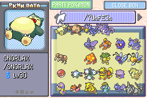

# FAQ and Troubleshooting

## General

### Is there’s a code for \[insert thing you want to do here\]?

Check these places first to see if there is an ACE code for that purpose:

*   [E-Sh4rk’s CodeGenerator](https://e-sh4rk.github.io/CodeGenerator/)
    (all)
    +   **For Japanese Emerald:** Prefer codes marked as “for 0x085F”,
        these codes tend to be more optimal for Japanese (shorter).
*   [claydolwithexplosion’s Gist](https://gist.github.com/claydolwithexplosion/017f1784deebcd118b61d3ad917edb3c)
    (mostly Non-Japanese Emerald, with very limited codes available for
     Japanese Emerald)
*   [Sleipnir17’s Pastebin](https://pastebin.com/u/Sleipnir17)
    (nearly every language, game, and ACE method other than
     Ruby and Sapphire Swap/Grab ACE)
*   [BluMagma’s Pastebin](https://pastebin.com/xxEDMCRW)
    (English Ruby and Sapphire Swap/Grab ACE)
*   [Bonziri’s blog](https://blog.bzl-web.com/) (Japanese Emerald)
*   [Detelony’s blog](http://detelony.blog.fc2.com/)
    (Japanese FireRed and LeafGreen Swap/Grab ACE, and Japanese Emerald)

This is just a list of somewhat well known sources for ACE codes, there
might be other locations where codes can be found.

If you have checked the above sources for the ACE code and can not find
a code for your purpose, that likely means that someone has not made one
yet. At this point, you can then ask if someone has made the desired code,
and see if there is one in an obscure location. If you are technically
inclined, you can also learn how to make an ACE code yourself. The FAQ
[*How can I make my own ACE code?*](#how-can-i-make-my-own-ace-code)
should give a quick idea of what is needed to create an ACE code as well,
as a few resources to help you.

### The code isn’t working

Before triggering ACE, make sure that you have tried to do the following:

*   Done all prerequisite steps for the **particular** code you wanted.
    This may include:
    +   Setting up a particular exit codes (e.g.
        [Box 14 exit](./frlg/exit-codes/box-14-exit.md),
        [Wallpaper exit](https://gist.github.com/claydolwithexplosion/017f1784deebcd118b61d3ad917edb3c#making-long-codes-with-wallpapers),
        [Certificate exit bootstrap](https://e-sh4rk.github.io/ACE3/emerald/getting-started/exit-code/),
        etc.)
    +   Created specific bootstraps for the code (e.g.
        `_ _ D n ’ J k l` nickname bootstrap)
    +   Triggering ACE in a specific location (e.g.
        Viridian City Pokémon Center,
        Mauville City Pokémon Center,
        Route 5 Daycare etc.)
    +   There might be other steps you will have to do, make sure to
        always read the attached instructions with the code!
*   You have changed the box names to the ones for your code. Make sure
    that you have entered these codes **correctly**!
*   Make sure that specific box slots and/or all box slots past the ACE
    entrypoint are **empty**.
    +   Generally exceptions are made for special Pokémon created
        specifically for ACE such as bootstrap Pokémon or various bad
        egg payloads such as the crafting table.

If you have done all of htat and the code still does nothing or causes a
crash, then read the following items to figure out what might have went
wrong with your code.

#### You typed the box names wrong

Here are some characters that are commonly mistaken, you should pay close
attention to them while entering the box names. Different websites use
different fonts for these symbols so you might need to pay extra attention
on some websites (unless of course they have been clearly annotated as
such by the code author):

*   Spaces
*   `‘` (left single quote) and `’` (right single quote)
    +   Sleipnir17’s Pastebins call these lefty `'` and righty `'`
        respectively.
*   Double quotes
    +   `“` and `”` in English, Italian, and Spanish games.
    +   `«` and `»` in French games.
    +   `„` and `“` in German games.
    +   Sleipnir17’s Pastebins call these lefty `"` and righty `"`
        respectively.
*   `O` (uppercase o) and `0` (number zero)
*   `l` (lowercase L), `1` (number one), `I` (uppercase i),
    `i` (lowercase I) and `!` (exclamation mark)
*   `...` (Sleipnir17 representation of `…`), `…` (ellipsis),
    `‥` (two-dot ellipsis), `.` (full stop, period) and `,` (comma).
*   `_` (space in CodeGenerator) and `-` (hyphen, dash)

#### You have Pokémon data present in box slots that are meant to be empty

First make sure that you moved any Pokémon out of any box slots targeted
by the code (unless the code explicitly instructs you to place or leave
a Pokémon in a slot), and also move Pokémon out of the “ACE area” (with
exceptions for special ACE Pokémon and bootstraps). The ACE area is
generally all box slots past the entrypoint (i.e. the box slots where
the ACE first enters the boxes), though special bootstraps
may move the ACE area to a later point within the boxes or make certain
box slots safe for Pokémon storage.

Examples of ACE areas are:

*   Non-Japanese Emerald (ARM):
    Last 3 slots of Box 11, and all of Boxes 12, 13, and 14
*   Non-Japanese Emerald (Thumb):
    All of Boxes 12, 13, and 14
*   Japanese Emerald (ARM):
    Starts from Box 12, Slot 12, and all of Boxes 13 and 14
*   Japanese Emerald (Thumb):
    Starts Box 12, Slot 15, and all of Boxes 13 and 14
*   Non-Japanese FireRed and LeafGreen (0x0351):
    Starts from Box 13, Slot 7, and then all of Box 14.
*   Japanese FireRed and LeafGreen (0xFFC9):
    Last 3 slots of Box 12, and all of Boxes 13, and 14

If it still crashes after clearing these boxes, then that means ghost
data is present on the save. Ghost data often appears on a
generation III save when Pokémon has been transferred via Pal Park.
This is most often just leftover data of the Pokémon transferred but the
species (and `hasSpecies`) has been set to 0 and false respectively.
The ghost data must be removed via group selection, see
[*Using group selection to mass clear invisible bad eggs and ghost data*](#using-group-selection-to-mass-clear-invisible-bad-eggs-and-ghost-data)
for more information.

#### You made a mistake in the ACE setup itself

Usually, this can be attributed to the wrong ACE species and/or moves, as
well as other bootstraps associated with the set up. 

### How can I delete bad eggs and/or unwanted glitch Pokémon?

There are multiple methods to do this, each will be covered one by one.

#### Using reverse Battle Tower cloning to delete Pokémon and bad eggs

Note

This will **not** work on some fake cartridges, as this is essentially
the Battle Tower Cloning glitch, which relies on certain parts of the
saving function that were implemented differently on fake cartridges.

In the Battle Tower, make sure that you have up to four unwanted bad
eggs or Pokémon in your party as well as two other Pokémon.

Then **save** the game.

Open the PC, then deposit the **unwanted** bad eggs or Pokémon into any
box.

Then **talk** to the Battle Tower guide closest to the PC. **Select**
*Challenge*, then **select** *Level 50*. Enter in the two Pokémon that
you have chosen to keep. **Confirm** the **first** dialogue
(“Before entering a BATTLE ROOM…”) for saving progress.

When the second save screen appears (it will have your save location,
player name etc.) you should then **soft reset**.

When loading the save again, you will still be in front of the Battle
Tower guide but when you enter the PC again, the unwanted Pokémon you
deposited will no longer be present.

Visual demonstration of reverse cloning is available in
[this video](https://www.youtube.com/watch?v=BapXdh-lYMQ)
by Sleipnir17.

#### Using a fast (de)cloner glitch Pokémon to delete Pokémon

First make sure that you have a fast cloner Pokémon to begin with. If
you do not, then create one before proceeding. This guide will also
assume that you have placed the fast cloner in the very last slot of a
box (bottom right corner).

Make sure you are in the PC’s **Move Pokémon** mode.

**Switch** to the box containing the unwanted Pokémon.

Then switch the selection mode to **Relocate Mode** by
pressing <kbd>SELECT</kbd>, the cursor should have changed to an orange
colour indicating that the current mode is **Relocate Mode**.

In Relocate mode, move the cursor over to the first (or very last) Pokémon
in the box (again ideally should be in the **first** slot) then start
the selection by **holding** <kbd>A</kbd>.

While holding <kbd>A</kbd>, move the cursor in a way that forms a rectangle
(starting from the first slot grabbed) that covers all of the unwanted
Pokémon, you must make sure that the slot the cursor is hovering over is
**empty**. **Release** <kbd>A</kbd>. Your cursor should then grab the
**all** of the Pokémon covered by the rectangle.

Then **switch** to the box containing the fast cloner, then move the
cursor over the fast cloner. Then exit the PC by pressing <kbd>B</kbd>
twice [^1]

Visual demonstration of fast decloning is available in
[this video](https://www.youtube.com/watch?v=Sa9nEZBU3DI)
by Sleipnir17.

[^1]:
    Many tutorials will have you press <kbd>A</kbd> to grab the fast
    cloner instead to declone. While this does work for some fast cloner
    species, for others (such as 0x3200 on English FireRed), it sometimes
    can result in a freeze.

#### Using group selection to clear invisible bad eggs

Make sure you are in the PC’s **Move Pokémon** mode.

**Switch** to the box containing the unwanted Pokémon.

Then switch the selection mode to **Relocate Mode** by
pressing <kbd>SELECT</kbd>, the cursor should have changed to an orange
colour indicating that the current mode is **Relocate Mode**.

In Relocate mode, move the cursor over to the first (or very last) Pokémon
in the box (again ideally should be in the **first** slot) then start
the selection by **holding** <kbd>A</kbd>.

While holding <kbd>A</kbd>, move the cursor in a way that forms a rectangle
(starting from the first slot grabbed) that covers all of the invisible
bad eggs. **Release** <kbd>A</kbd>. Your cursor should then grab the
**all** of the Pokémon covered by the rectangle.

**Press** <kbd>A</kbd> again, the invisible bad eggs should disappear.
You can check by pressing <kbd>A</kbd> again, and no menus should appear.
If any menus appear, that means the invisble bad egg occupying the slot,
might be a different kind of invisible bad egg that will require extra
steps to clear. See
[*Using reverse Battle Tower cloning to delete Pokémon and bad eggs*](#using-reverse-battle-tower-cloning-to-delete-pokémon-and-bad-eggs)
or 
[*Using a fast (de)cloner glitch Pokémon to delete Pokémon*](#using-a-fast-decloner-glitch-pokémon-to-delete-pokémon)
for alternate methods to delete these particular invisible bad eggs.

The GIF demonstration in *Using group selection to mass clear invisible bad eggs and ghost data*
should apply to this method, just ignore the box switching or the grabbing
of a whole box.

#### Using group selection to mass clear invisible bad eggs and ghost data

Ideally, this movement should start in a box that has all of its slots
filled with Pokémon. This also assumes that the boxes you want to clear
of invisible bad eggs also already had Pokémon moved to a different.

Make sure you are in the PC’s **Move Pokémon** mode.

Then switch the selection mode to **Relocate Mode** by
pressing <kbd>SELECT</kbd>, the cursor should have changed to an orange
colour indicating that the current mode is **Relocate Mode**.

In Relocate mode, move the cursor over to the first (or very last) Pokémon
in the box (again ideally should be in the **first** slot) then start
the selection by **holding** <kbd>A</kbd>.

While holding <kbd>A</kbd>, move the cursor over to the last slot of the
box, then **release** <kbd>A</kbd>. Your cursor should then grab the
**all** of the Pokémon that was in the box.

Switch to a different box by pressing <kbd>←</kbd> or <kbd>→</kbd>,
you should switch to the box that you want to clear of possible invisible
bad eggs.

Once you are in the box that you want to clear of invisible bad eggs,
**press** <kbd>A</kbd> again. All of the Pokémon that the cursor was
holding should be placed down. If you happen to get a message that you
can not place them there but there is clearly nothing in the box you
want to clear of invisible bad eggs, you might have a different kind of
invisible bad egg in that box that will require extra steps to clear.
See
[Using reverse Battle Tower cloning to delete Pokémon and bad eggs](#using-reverse-battle-tower-cloning-to-delete-pokémon-and-bad-eggs)
or 
[Using a fast (de)cloner glitch Pokémon to delete Pokémon](#using-a-fast-decloner-glitch-pokémon-to-delete-pokémon)
for alternate methods to delete these particular invisible bad eggs.

### How can I make my own ACE code?

For all ACE methods, you must know some ARM/Thumb assembly. The below
resources should give you some sort of a grasp on ARM/Thumb assembly.
Keep in mind that some ACE will make use of what the ARM Architecture
Reference Manual calls “UNPREDICTABLE” behavior, and many box name codes
(especially in non-Japanese games) will often abuse these UNPREDICTABLE
behaviours as there is often no other options.

*   [Whirlwind Tour of ARM Assembly](https://gbadev.net/tonc/asm.html)
    in [tonc](https://gbadev.net/tonc/) by cearn et al.
*   ARM Architecture Reference Manual by ARM.
    +   [Issue B (1996)](https://e-sh4rk.github.io/CodeGenerator/doc/armv4t.pdf)
    +   [Issue D (2000)](https://home.marutan.net/arcemdocs/ARM-ARM-RevD.pdf)
    +   [Issue I (2005)](https://documentation-service.arm.com/static/5f8dacc8f86e16515cdb865a?token=)

For creating box name codes, you must at least know about the character
encoding, and the internal memory layout of the box names in generation III
so that you have an idea of how to encode the ARM/Thumb machine code
into writable box names. Additionally there are tools available that
allow you to automate the encoding of these ARM instructions into the
character set and even generate sequences of ARM instructions that
replicate impossible or unwritable instructions in the restricted
ARM/Thumb assembly available with the character encoding. The following
tools and resources should help with creating box name codes:

*   [Character encoding (Generation III)](https://bulbapedia.bulbagarden.net/wiki/Character_encoding_(Generation_III)#Character_sets)
    on Bulbapedia
*   [`PokemonStorage`](https://github.com/pret/pokeemerald/blob/d1d543548772cbdf087c5ccc1e0b19980aa9ad87/include/pokemon_storage_system.h#L23)
    struct in the
    [pokeemerald](https://github.com/pret/pokeemerald/)
    decompilation by pret
*   [CodeGenerator](https://e-sh4rk.github.io/CodeGenerator/)
    by E-Sh4rk
    ([documentation](https://e-sh4rk.github.io/CodeGenerator/doc/index.html))
*   [rse-text-decoder](https://it-is-final.github.io/rse-text-decoder/)
     by final/togebit

If the code you are making also relies on NPC scripting, you also must
know about the game’s scripting interface. That would be the scripting
bytecode used by the game. Additionally you can also learn to use an
abstraction such as the XSE scripting language which with some tools
can compile down to the scripting bytecode used by the game. The following
tools and resouces can help with scripting in the generation III games:

*   [Pokémon FireRed Scripting Commands](https://sphericalice.com/romhacking/documents/script/)
    by SphericalIce
*   [`scrcmd.c`](https://github.com/pret/pokefirered/blob/287b37eed2b3a0ab5e5310dcd095047d3cc2f1ea/src/scrcmd.c)
    in the
    [pokefirered](https://github.com/pret/pokefirered/)
    decompilation by pret
*   [HexManiacAdvance](https://github.com/haven1433/HexManiacAdvance)
    by haven1433
*   [Theocatic’s scripting environment documentation](https://gist.github.com/Theocatic/39ed337ecd590b47fad14f791cf16bb5#notes-on-writing-scripts-for-this-setup)

## Pokémon FireRed and LeafGreen

### The 0x0351 mail did not work

Note

This is for the [Post-Elite Four route](./frlg/getting-started/non-jpn-ace/post-e4-route.md).

If you are doing the [Pre-Elite Four route](./frlg/getting-started/non-jpn-ace/pre-e4-route.md),
this does not apply to you, go to
[My HOCK turned into a bad egg](#my-hock-turned-into-a-bad-egg).

Make sure that you have selected the “MAGIKARP” word from the
**POKéMON** group, not from A-Z mode or the POKéMON2 group. This is
because the internal word index used for MAGIKARP differs between the one
present in the POKéMON group and the one for the POKéMON2 group (which
also gets used in A-Z mode if you have beaten the Elite Four).

### My HOCK turned into a bad egg

This means one of two causes (in order of likelihood):

- You made a mistake in EV training
- You entered the wrong mail words

For both cases, provided that you have enough mail, you can just create
another HOCK. You just simply delete the erroneous bad egg (you can use
the steps described in
[*Using group selection to clear invisible bad eggs*](#using-group-selection-to-clear-invisible-bad-eggs))
and create HOCK again using the guide.

### Bad eggs are appearing in Box 13

This is a known side effect of glitch species 0x0351 (the main grab ACE
Pokémon used for non-Japanese FireRed and LeafGreen), that has to do with
its long name. Long story short, due to the long name, another internal
pointer (variable that stores the address of something) is corrupted with
an “address” that happens to point to somewhere within Box 13. It just
turns out that this internal pointer is dereferenced (accessing the stuff
the pointer “points” to) quite often when performing various actions in
the PC, and some of these actions also happen to write values to whatever
was supposed to be accessed via the pointer which causes the bad eggs you
see in Box 13.

Note that these bad eggs (or rather corruptions) will only ever affect
the 7th, 8th, or 9th slots of Box 13. Thus you should **never** store
valuable Pokémon or most special ACE Pokémon in these box slots, to avoid
possible corruptions.

Additionally, you can always immediately exit the PC upon viewing the
information of 0x0351 (after placing it in a different slot). This should
minimise the opportunities of running the game code that performs the
unwanted corruptions to Box 13. For this prevention technique to work,
you should store 0x0351 in a box other than Box 13 or Box 14.

## Pokémon Emerald

### I do not have a clean DOTS to EV train

In that case, you can also try to acquire SEASOR the Horsea from the
in-game trade in Pacifidlog Town, corrupting SEASOR works similarly as
corrupting DOTS. If you do not have that option, then you can either
need to trade in a DOTS from another save file, or acquire another
Pokémon that has the same “corruption type” as DOTS or SEEDOT.

More details on corruption types can be found in
[this YouTube video by Sleipnir17](https://www.youtube.com/watch?v=9ZeP9Np6zeU).
Keep in mind that if you choose to do this route, you will need to make
sure that the Pokémon you are using is compatible with an “unmarked
Caterpie” initiator (like Pluses).

### I do not have a clean PLUSES

In this case you can also try cloning a clean copy of DOTS, and giving
that 10 Speed EVs (one Carbos) and evolving it into a Shiftry. That will
work as a PLUSES replacement.

As a last resort, you can always try doing the corruption using no
corruption initiators (that is what PLUSES does in the corruption). The
odds of success will be much lower than the typical Pomeg corruption
process used in most ACE guides but it does work.

### My trainer card stats look corrupted

This is a known side effect of hatching glitch species 0x0611 (the initial
glitch Pokémon that is hatched from an egg for ACE) that is caused by its
very large National Pokédex number (33845). What happens is that the game
will try to set the corresponding owned flags in the Pokédex (indexed by
National Pokédex number) for entry 33845. The “flags” for the 33845th
“entry” in the Pokédex happens to be located at the same memory address
as where the save’s encryption key is stored, more precisely bit 20 is
set. The encryption key also happens to change randomly (presumably to
deter cheaters) so the corruption only happens 50% of the time as it
depends on whether bit 20 of the encryption key is already set before
the corruption.

One way of avoiding the corruption (as well as fixing it, should you run
into the misfortune of having it affect your save) is to save before you
trigger ACE. Then try triggering ACE through hatching the egg. Check your
trainer card. If it is normal then it should be fine to continue doing
everything as normal. Otherwise if it shows the corruption, simply
soft-reset and try triggering ACE again.

A more reliable (and less random) way of avoiding the corruption is to
simply not use species 0x0611 for executing your ACE codes. Instead you
can use the many number of Emerald ACE guides such as
[this one](https://gist.github.com/claydolwithexplosion/017f1784deebcd118b61d3ad917edb3c)
or [this one](https://e-sh4rk.github.io/ACE3/)
that will set you up with a stable species that does not rely on the egg
hatch mechanic (avoiding the issue of “registering” 0x0611 into the
Pokédex). Though if you already have the corruption prior to setting up
stable ACE and none of the 0x0611 executions have fixed up the trainer
card, then you can try the solution in the previous paragraph, or wait
for someone to make a code that undoes the corruption.
