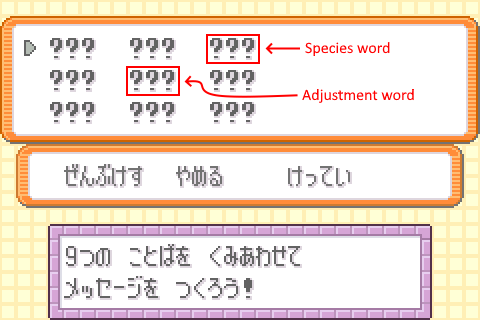
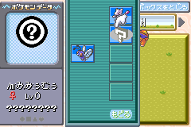

In this tutorial, you will be setting up arbitrary code execution in Japanese FireRed or LeafGreen through the PC shift/swap action in the Pokémon Storage System. Through the mail glitch, you will transform a donor Pokémon into a glitch Pokémon that will then be used to generate glitch species 0xFFC9 which is the standard ACE species used in Japanese FireRed and LeafGreen.

## Prequisites

*   Your save has the mail glitch active, and you know how to use it.
    +   If not, please read [this article](mail-glitch.md) to learn how to activate it.

## Getting the donor Pokémon

For this method, you will need to acquire a Pokémon with a specific personality value (<abbr>PID</abbr>), which depends on the value of the donor Pokémon’s original trainer’s TID. More specific details (i.e. how it is calculated) about this PID is available [here](../../../technical-documentation/jpn-grab-ace-set-up.md). In short, it allows for overwriting the species field with an the index of a specific mail word (let this mail word be called the **species word**) that will be interpreted as one of the many glitch species that can enable ACE in FireRed and LeafGreen[^1].

There are two (somewhat viable) methods that you could use to acquire the donor Pokémon: RNG manipulation, and brute forcing at the Celadon Game Corner.

[^1]: The full list of ACE species for FireRed and LeafGreen is at [here](https://github.com/pomeg-letterbombers/ace-setup-tools/blob/main/res/FireRed_Species.csv) for FireRead, and [here](https://github.com/pomeg-letterbombers/ace-setup-tools/blob/main/res/LeafGreen_Species.csv) for LeafGreen.

*   [With RNG manipulation](#with-rng-manipulation)
*   [Without RNG manipulation](#without-rng-manipulation)

### With RNG manipulation

For this method, you should be familiar with RNG manipulation in Pokémon FireRed and LeafGreen. If not, you should either follow the other method ([Brute forcing at the Celadon Game Corner](#brute-forcing-at-the-celadon-game-corner)), or follow these guides for either [retail](https://retailrng.com/frlg/) or [emulator](https://www.pokemonrng.com/fire-red-and-leaf-green/).

While you can target any encounter for the RNG manipulation, it is recommended (especially for retail) that you use either the Eevee at Celadon Mansion, or Scyther<sup>FR</sup>/Pinsir<sup>LG</sup> at the Celadon Game Corner (ideally the ones with high stats) as the target encounter for this RNG manipulation. As such further instructions will assume that you are targeting either of these encounters for the RNG manipulation (make deviations as needed if you are **not** targeting these encounters).

<div class="admonition note" markdown="block">
<p class="admonition-title">For emulator users</p>

We are assuming that you are using a Lua script (like the one [here](https://github.com/Real96/PokeLua/blob/main/Gen%203/mGBA/FRLG_RNG_mGBA.lua)) to perform the RNG manipulation. If you wish to not use Lua scripts, follow the instructions for console users. Keep in mind though that there are currently issues with emulators not being able to hit initial seeds in the same manner as console, so you are on your own if you choose to do the console method on emulator.

</div>

First open the [**Donor Search**](https://pomeg-letterbombers.github.io/ace-setup-tools/donor-search/) tool, this tool allows you to find the target advance(s) for a suitable donor Pokémon. We recommend setting the parameters as shown below.

<dl markdown="block">
<dt>Game version</dt>
<dd markdown="block">

Set this to the game version you are playing on.

</dd>
<dt>Encounter type</dt>
<dd markdown="block">

Set this to **Static**.

</dd>
<dt>Seed</dt>
<dd markdown="block">

**For console:** Set this to an early seed (i.e. a low frame number) in one of these spreadsheets. Choose the spreadsheet appropriate for your game version.

*   [FireRed 1.0](https://docs.google.com/spreadsheets/d/1GMRFM1obLDcYbR6GR6KrE8UZotA7djUTw8PxqVFnCVY/edit?pli=1&gid=1608943801#gid=1608943801)
*   [FireRed 1.1](https://docs.google.com/spreadsheets/d/1aQeWaZSi1ycSytrNEOwxJNoEg-K4eItYagU_dh9VIeU/edit?gid=791743105#gid=791743105)
*   [LeafGreen](https://docs.google.com/spreadsheets/d/1LSRVD0_zK6vyd6ettUDfaCFJbm00g451d8s96dqAbA4/edit?gid=1862478029#gid=1862478029)

**For emulator:** After starting the game, press <kbd>A</kbd> or <kbd>START</kbd> on the title screen and pause the game (using <kbd>Ctrl</kbd> + <kbd>P</kbd> or whatever other keybind your emulator uses). Then note down whatever initial seed shows up in the script’s interface. Or you can just write any 16-bit value (0–65535), then use your script’s initial seed bot to hit that seed.

</dd>
<dt>Species word settings</dt>
<dd markdown="block">

By default (i.e. no checkboxes under this group are checked), the searcher will exclude any unlockable words from the search. These checkboxes allows the tool to also search through the certain unlockable words.

*   **Use unlockable words** will allow the **species word** to also be a word that is unlockable before entering the Hall of Fame.
*   **Use post-Elite Four words** will allow the **species word** to be also be a word that is unlockable after entering the Hall of Fame.

</dd>
<dt>Initial advances</dt>
<dd markdown="block">

Set this to **350** for the Celadon Mansion Eevee, or **550** for the Game Corner prize Pokémon.

</dd>
<dt>Advances</dt>
<dd markdown="block">

Set this to **100**.

</dd>
<dt>Delay</dt>
<dd markdown="block">

*   **For console:** Set this to **0**.
*   **For emulator:** Set this to **4** for the Celadon Mansion Eevee, or **3** for the Game Corner prize Pokémon.

</dd>
</dl>

Once you have entered these parameters, click on <kbd>Find</kbd>.

The <i>Results</i> table should be populated with entries. Each entry consists of an <i>Advance</i> number, and the PID of the corresponding generated Pokémon. Select one of these targets to target for the RNG manipulation.  If you are unsure on which advance to target, use the below guide.

*   **For Celadon Mansion Eevee:** Target the advance closest to advance **400**.
*   **For Game Corner Scyther<sup>FR</sup>/Pinsir<sup>LG</sup>:** Target the advance closest to advance **600**.

Once you have the target Pokémon, then continue to the [Species word finder](#species-word-finder) section.

### Without RNG manipulation

In the game, make sure that you have large amounts of coins and Rare Candies (mail glitch’s item duplication should allow you to obtain large amounts of each easily). It is also recommended to have a party of only one Pokémon, this just makes mass checking easier. At the Celadon Game Corner, save in front of the clerk that gives out the prize Pokémon.

Then buy a prize Pokémon (we recommend Scyther<sup>FR</sup>/Pinsir<sup>LG</sup>), then find the Pokémon’s IVs using an IV calculator (any is fine, as long as it is for generations 3, 4, or 5).

<table markdown="block">
<thead>
<tr>
<th scope="col"></th>
<th scope="col">Pros</th>
<th scope="col">Cons</th>
</tr>
</thead>
<tbody markdown="block">
<tr markdown="block">
<th scope="row">Abra</th>
<td markdown="block">

*   Cheap
*   Has two abilities

</td>
<td markdown="block">

*   Comes at a low level
*   75% ♂ 25% ♀ gender ratio

</td>
</tr>
<tr markdown="block">
<th scope="row">Scyther<sup>FR</sup>/Pinsir<sup>LG</sup></th>
<td markdown="block">

*   Comes at a higher level
*   50% ♂ 50% ♀ gender ratio

</td>
<td markdown="block">

*   Costs many coins
*   Has one ability

</td>
</tr>
</tbody>
</table>

Once you have the IVs, you will be using a tool (we call this **IVs to PID**) to try find the Pokémon’s personality value from the IVs. A web tool for this task is available at this link: <https://it-is-final.github.io/ivs-to-pid/>.

With this tool, set the parameters as shown below:

<dl markdown="block">
<dt>HP, Attack, Defense, Sp.Attack, Sp.Defense, Speed</dt>
<dd markdown="block">

**Input** your Pokémon’s corresponding **IV**.

</dd>
<dt>Nature</dt>
<dd markdown="block">

**Select** your Pokémon’s **nature**.

</dd>
<dt>Ability</dt>
<dd markdown="block">

If the Pokémon has two distinct abilities, then **select** **0** for the first ability, or **1** for the second ability. You can quickly find out the ability number using a website like <https://pokemondb.net>. Otherwise leave this blank.

</dd>
<dt>Gender</dt>
<dd markdown="block">

**Select** your Pokémon’s **gender**.

</dd>
<dt>Gender ratio</dt>
<dd markdown="block">

**Select** your Pokémon’s **gender ratio**. Once again, you can use a website to find this information.

</dd>
<dt>TID</dt>
<dd markdown="block">

You can safely ignore this, it has no bearing on this process.

</dd>
</dl>

Once you have entered these parameters, click <kbd>Find</kbd>. Results should have populated the table in the tool, ignore all results not labelled **Method 1** (maybe include **Method 4** if you are playing on a **really** old emulator), these are the potential PIDs that this prize Pokémon could have.

Continue to the [Species word finder](#species-word-finder) section.

### Species word finder

Next you will be using a tool (we call it the **Species Word Finder**) to both determine if the Pokémon is suitable for use as a donor Pokémon and find various important variables for this tutorial. The tool is provided at <https://pomeg-letterbombers.github.io/ace-setup-tools/species-word-finder/>. This tool takes the Pokémon’s personality value (PID), its original trainer’s ID number (TID), the game version as well as a few optional parameters that widens the range of mail words are searched.

Below is an explanation of the **Species word settings**:

<dl markdown="block">
<dt>Species word settings</dt>
<dd markdown="block">

By default (i.e. no checkboxes under this group are checked), the searcher will exclude any unlockable words from the search. These checkboxes allows the tool to also search through the certain unlockable words.

*   **Use unlockable words** will allow the **species word** to also be a word that is unlockable before entering the Hall of Fame.
*   **Use post-Elite Four words** will allow the **species word** to be also be a word that is unlockable after entering the Hall of Fame.

</dd>
</dl>

Below is an explanation for each item in the **results area**:

<dl markdown="block">
<dt>PID substructure order</dt>
<dd markdown="block">

This is the order in which the encrypted substructures of the Pokémon’s data is laid out, with **G** for **Growth**, **A** for **Attacks**, **E** for **EVs/Conditions**, and **M** for **Miscellaneous**. This is just technical details for people who want to know more.

</dd>
<dt>Encryption key</dt>
<dd markdown="block">

This is one half of a value that is used to encrypt the Pokémon data. This half happens to be relevant for the operations we are doing. This half is formed by: (<var>PID</var> mod 65536) &oplus; <var>TID</var>.

</dd>
<dt>Adjustment type</dt>
<dd markdown="block">

Can be “EV”, “Experience”, or “None”. This determines which stats you will have to adjust in order for the mail corruption to keep the Pokémon’s checksum valid. If this value is **None**, that means the Pokémon is not suitable for use as a donor Pokémon.

</dd>
<dt>Species index</dt>
<dd markdown="block">

This is the internal index that is used to identify this “species” in the game’s code.

</dd>
<dt>Entrypoint</dt>
<dd markdown="block">

When ACE is triggered, this is the **earliest point** in the PC boxes where the program counter can start reading machine code from. This and all slots after it **will** be interpreted as machine code. Make sure that this and all following box slots are **empty** (or contain Pokémon with special data expressly for ACE applications) when triggering ACE. Note that due to ASLR, where the program counter actually enters in the boxes can vary from execution to execution.

</dd>
<dt>Word index</dt>
<dd markdown="block">

This is the internal index that is used to identify this word in the game’s code.

</dd>
<dt>Word group</dt>
<dd markdown="block">

This is the word group of the **species word**, which may be useful if you prefer to use the default group view to find the word you want to enter.

</dd>
<dt>Word</dt>
<dd markdown="block">

This is the **species word**, which is the word that overwrites your species in a way that it turns your Pokémon into one of the many glitch Pokémon that can trigger ACE.

</dd>
</dl>

Enter the Pokémon’s PID (if the IVs to PID tool returned multiple, then select one) and its TID, select the game you are using, then click <kbd>Find</kbd>.

If you see results in the table, that means the Pokémon is suitable for use as a donor Pokémon. Take note of the **encryption key**, and **adjustment type**, as well as the **entrypoint**, **species index**, and **word** of one of the table entries (if there are multiple, you can use the [Checksum Adjustment Calculator](https://pomeg-letterbombers.github.io/ace-setup-tools/adjustment-calc/) to check each species, then select the one that requires the least amount of effort to adjust, make sure that **Search easy chat words** is checked).

If you see a **None** adjustment type, and/or no results in the table, that means the Pokémon is not suitable for use as a donor Pokémon. First, if you used Donor Search to find your donor Pokémon, then make sure that the **Species word settings** for this tool are the **same** ones you used for Donor Search then try again. If the IVs to PID tool returned multiple PIDs, you may try the other options and check if they show indicators that the Pokémon **is** suitable as a donor Pokémon. Otherwise you must acquire a different Pokémon and continue checking, until you have a Pokémon that is seen as a suitable donor Pokémon by the tool.

## Adjusting the donor Pokémon

<div class="admonition warning" markdown="block">
<p class="admonition-title">Warning</p>

Make sure you save **here**, and do not perform further saves until instructed so that you have a recovery point in case anything goes wrong.

</div>

Next you will be using a tool (we call it the **Checksum Adjustment Calculator**) to determine the stat adjustment to apply to the Pokémon, as well as another mail word which will be used to keep the checksum valid. The tool is provided at: <https://pomeg-letterbombers.github.io/ace-setup-tools/adjustment-calc/>. This tool takes the donor Pokémon’s **adjustment type**, **encryption key**, **base species index**, **new species index** (i.e. the species index of the glitch Pokémon), and if the adjustment type is **experience**, it will also the take Pokémon’s current experience.

If you have a specific mail word you wanted to use for correcting the checksum, then enter its index in **Checksum Word Index** (you can find the index of Japanese mail words [here](https://gist.github.com/it-is-final/1e55b12b97bba7db1524c81ed77c7bb9)). Otherwise, you should check the **Search easy chat words** checkbox. There you can also expand the range of mail words searched with the further checkboxes which has already been explained in the acquiring donor Pokémon pages.

Enter the parameters, then click <kbd>Find</kbd>.

Information about the checksum word as well as the adjustment needed should appear. Take note of the checksum word, and the adjustment. The adjustment shown is what the final value of the stat should be before performing mail corruption on the donor Pokémon. For the **EV** adjustment type, adjusting both the **HP** **and** **Attack** **or** the **Sp.Attack** **and** **Sp.Defense** should be enough. You should pick one of the pairs to adjust and note down which EV pair you chose to adjust for later.

Make sure to adjust the stats before following the instructions in the next section.

## Mail corrupting the donor Pokémon

Place the donor Pokémon in Box 3, Slot 1. Then trigger the mail glitch. What you will write will depend on the adjustment type, and how you adjusted your Pokémon specifically. A graphic has also been provided as a visual aid.

*   **Experience-adjusted Pokémon:** The **species word** must be the **third** word, and the **checksum word** must be the **fifth** word.
*   **EV-adjusted Pokémon (all):** The **species word** must be the **ninth** word
    +   **HP/Attack:** The **checksum word** must be the **third** word.
    +   **Sp.Attack/Sp.Defense:** The **checksum word** must be the **fifth** word.

<div class="grid" markdown>
<figure markdown="span">

{ width=300px }
<figcaption>Guide for experience adjustment type</figcaption>

</figure>
<figure markdown="span">

{ width=300 }
<figcaption>Guide for EV adjustment type</figcaption>

</figure>
</div>

Confirm the mail, then check Box 3 again. A **glitch Pokémon** (usually shown as a ? or stealing the sprite of party Pokémon with the wrong pallete) should have replaced your donor Pokémon. You can save if you see this.

### In case of failure

If a **bad egg** appeared instead it could be caused by the following:

*   The words are in the wrong slot of the glitch mail.
    +   If you have a recovery point, at the point when you are writing mail, make sure that you are writing the correct words in the right places.
*   The Pokémon is not adjusted correctly.
    +   If you have a recovery point before writing the mail, depending on the adjustment type, you should do the following:
        -   **Experience-adjusted Pokémon:** If the experience is over the what the adjusted experience should be, redo the [Adjusting the donor Pokémon](#adjusting-the-donor-pokémon) instructions with the new experience. Otherwise add more experience until it is equal to what the adjusted experience should be.
        -   **EV-adjusted Pokémon:** If you have not been tracking your EVs properly, you should redo the EVs while tracking them properly. If you somehow saved right before the mail corruption (despite explicit warnings against this), then you must start again and [reacquire a donor Pokémon](#getting-the-donor-pokémon).
*   The reported PID used as the Pokémon's PID in the tool is not the Pokémon's PID.
    +   This case only happens if the donor Pokémon is not obtained via RNG manipulation, and from the IVs to PID tool there were multiple possible PIDs for the given set of IVs, gender, nature, and ability. In this case, start back at [Getting the donor Pokémon](#getting-the-donor-pokémon) and if there is no other possible PIDs that allow the donor Pokémon to be useable, then you must catch a different Pokémon.

## Creating 0xFFC9

<div class="admonition tip" markdown="block">
<p class="admonition-title">Tip</p>

If you have converted your Pokémon to glitch species 0xFFC9 from the previous section, then you may skip this section.

</div>

The new glitch Pokémon in Box 3, Slot 1 can be used for triggering ACE. However there are a few reasons why we might not want to use this glitch Pokémon as our main entrypoint for ACE:

*   These glitch Pokémon have differing entrypoints in the PC boxes. The standard ACE environment, will usually expect ACE to start from a certain point in the boxes (in this case the standard entrypoint is 0x0203027F, which is around Box 12, Slot 29). If it starts later than expected then some ACE payloads may not work as expected.
*   Upon triggering ACE, the program counter might be interpreting these instructions using either the Thumb or ARM instruction sets. If the glitch Pokémon is an **ARM** species, this also makes it difficult to use most ACE codes, without needing a bootstrap since most Japanese FireRed and LeafGreen ACE codes are written in Thumb machine code.
*   Some of these glitch Pokémon might cause side-effects before or after triggering ACE in unknown ways not accounted for by standard ACE environments. This includes graphical glitches, as well as possible bad eggs generating in random places.

As such, with this Pokémon (we will call it the initial ACE species), we will only be using it to generate another glitch Pokémon (species 0xFFC9) which the standard ACE Pokémon in Japanese FireRed and LeafGreen (much like 0x0351 in non-Japanese versions). This Pokémon starts ACE from the standard entrypoint (0x027F027F, or 0x0203027F when masked), it interprets data as **Thumb** machine code when trigger ACE, and it has no known side-effects.

Make sure that the entrypoint of the initial ACE species, and all box slots following it are **empty**, and that you have two or less party members because this code will overwrite one of the party slots with glitch species 0xFFC9.

Set your box names to the ones shown below:

```
Box  1:	リ び … ｏ く ＿ ゼ ｎ	[リび…ｏく　ゼｎ]
Box  2:	＿ … ｔ ま ＿ １ ｔ ほ	[　…ｔま　１ｔほ]
Box  3:	ぁ ｍ ＿ ＿ あ い 　 　	[ぁｍ　　あい] (first ぁ is small, and second あ is regular)
Box  4:	ア Ｂ ぢ い い Ｎ 　 　	[アＢぢいいＮ]
Box  5:	Ｏ 　 　 　 　 　 　 　	[Ｏ]
Box  6+: (anything)
```

Then in the PC’s **Move Pokémon** mode, grab any Pokémon (except for the glitch Pokémon), and make sure the cursor is **orange** (press <kbd>SELECT</kbd> if it is not). Then swap this Pokémon with the glitch Pokémon by hovering it over the glitch Pokémon then pressing <kbd>A</kbd>. This should move the glitch Pokémon into the cursor, press <kbd>A</kbd> again and the other Pokémon should come back into the cursor. Place this Pokémon anywhere afterwards. An image below has been provided to illustrate how it should look.

<figure markdown="span">


<figcaption>Swapping two Pokémon in the PC</figcaption>

</figure>

After performing the swap, your game should not crash. If that is so, then you have just learned how to trigger ACE through swapping! Exit the Move Pokémon mode, then enter Deposit mode. In the third party slot, a glitch Pokémon should have appeared (as shown below), make sure to deposit it somewhere in the boxes.



If you see this (note that the name might vary, but as long as it looks similar, then its the correct Pokémon), that means the code worked, and you have ACE set up in Japanese FireRed or LeafGreen. You can trigger ACE at any time with this glitch Pokémon by setting the correct box names for your code beforehand then performing the aforementioned swapping with **this** glitch Pokémon.

### In case of failure

If a **bad egg** appeared in party slot 3, or the game **crashed** after performing the swap, or **nothing** happened after performing the swap, it could be caused by the following:

*   You made a mistake in writing the box names.
    +   Redo the box names, and make sure you have entered the correct characters.
    +   Check these box names again, its likely to be the cause of the crashes most of the time.
*   There is Pokémon or invisible Pokémon (can be caused by Pal Park migration) in the box slots after the glitch Pokémon’s entrypoint, or you forgot to clear out your party.
    +   You can move them out to an area of the PC before the entrypoint, or for the invisible Pokémon, you can use group selection to remove them.
    +   Make sure that before executing the code, there are 2 or less Pokémon in your party.
*   You somehow got the wrong glitch Pokémon.
    +   This only applies to cases where a crash, or nothing occurred rather than a bad egg appearing. If a bad egg appeared at all, that means the code was executed incorrectly, but the glitch Pokémon is still triggering ACE properly.
    +   First of all, check all of the other items on this list before you consider this to be the cause.
    +   If you are sure about this being the cause, then follow the failure notice in the [Mail corrupting the donor Pokémon](#in-case-of-failure) section.

## Appendix

### Removing the initial ACE Pokémon

You probably don’t want to keep the initial ACE Pokémon in the boxes, to remove it please do the following:

1. Place the glitch Pokémon in the party (using the orange hand).
2. Exit the PC, then go to the party menu.
3. Move the glitch Pokémon to the first party slot.
4. Go back to the PC and enter deposit mode.
5. Release the Pokémon by selecting the Pokémon then select release and confirm.
