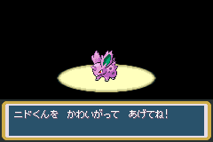
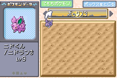
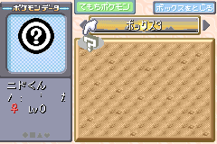
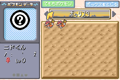

<div class="admonition important" markdown="block">
<p class="admonition-title">Important</p>

This method uses a **LeafGreen-exclusive** trade Pokémon (ニドくん the Nidoran♂). If you are on **FireRed**, and you do not have the means to obtain the trade Pokémon via other means, then follow the [other tutorial](jpn-ace.md).

</div>

This tutorial uses a trade Pokémon as the donor Pokémon for creating an ACE environment in Japanese FireRed and LeafGreen. This allows for more concrete instructions, as trade Pokémon have known data that is set.

## Requirements

*   Mail glitch active on your save.
    +   You can read the [Mail Glitch](mail-glitch.md) tutorial to learn how to do this. If you prefer a video tutorial then you can watch the part of [this video](https://youtu.be/3jkcq8e9NO4?t=147&feature=shared), only the first part is important for preparing the mail glitch.
*   Have at least 6 Retro Mail in the bag.
    +   You might need more Retro Mail to be able to clone enough Rare Candy to be able to level ニドくん to level 41.
*   Have at enough Rare Candy to level ニドくん to level 9.
    +   You can learn how to use mail glitch to clone Rare Candy [here](mail-glitch.md).
*   Have the ニドくん (Nidoran♂) trade available.
    +   This trade Pokémon has a lonely nature.
    +   The OT’s trainer ID is 63184.

There may be instances where you may already have ニドくん. In this case, you must make sure that ニドくん does not have these characteristics:

*   Has more than 493 experience points.
*   Is evolved.

If ニドくん has any of the “bad” characteristics outlined above, then you cannot perform this method, and you must use the normal method used in [the main tutorial](jpn-ace.md), though you can continue to use ニドくん as the donor Pokémon (its PID is 0x4C970B9E, and is always that value). You can follow the path without RNG manipulation in that guide, and skip the section using the IVs to PID tool since its PID is already known.

Otherwise below is a guide on what sections of this tutorial can be skipped if you already have ニドくん:

<dl markdown="block">
<dt>Getting ニドくん</dt>
<dd markdown="block">

Can be skipped

</dd>
<dt>Preparing ニドくん</dt>
<dd markdown="block">

Rare Candy section depends on ニドくん’s level:

*   If it is equal to 9, then it can be skipped entirely.

Daycare section depends on ニドくん’s experience:

*   If it is equal to 493, then it can be skipped entirely.
*   If it is less than 493, and it is an odd value, then the amount of steps to take is reduced.
*   If it is less than 493, and it is an even value, then a different method (e.g. wild battles) must be used to increase experience to 493 instead.

</dd>
</dl>

## Instructions

### Getting ニドくん

1.  Go to the Underground Pass entrance on Route 5, and trade a Nidoran♀ with the girl.




### Preparing ニドくん

<div class="admonition warning" markdown="block">
<p class="admonition-title">Warning</p>

Make sure you save **here**, and do not perform further saves until instructed so that you have a recovery point in case anything goes wrong.

</div>

1.  Use Rare Candy on ニドくん until he is at level 9.
2.  Once ニドくん is at level 9, go to the daycare in Route 5 (or the one in the Sevii Islands if your save is extra completed).
    +   At this point, ニドくん’s experience should be 419.
3.  Deposit ニドくん in the daycare and walk 74 steps, ending your last step in front of the daycare man.
4.  Withdraw ニドくん from the daycare, his experience should be 493.

    

5.  Place ニドくん into the first slot of box 3, and withdraw another box Pokémon to be the sixth party member.

    

### Corrupting ニドくん

1.  Give Retro Mail to the sixth party member, and write the following message to the mail.
    +   レベル as the 3rd word.
    +   Delete the 5th word.
    +   All other words left untouched.
    
    

2.  Confirm the mail, then check the Box 3 again, a glitch Pokémon should take the place of ニドくん.

    

### Finalising ACE

1.  Move four party members into the boxes with the last party member to move still held by the orange hand (can be activated by pressing SELECT).
2.  Rename Boxes 1-5 to the following:

    ```
    Box  1: リ び ‥ o く _ ゼ n	[リび‥oく ゼn]
    Box  2: _ ‥ t ま _ 1 t ほ	[ ‥tま 1tほ]
    Box  3: ぁ m _ _ あ い	[ぁm  あい]
    Box  4: ア B ぢ い い N	[アBぢいいN]
    Box  5: O	[O]
    ```

3.  With a Pokémon still in the orange hand, go back to Box 3, and swap the glitch Pokémon with the Pokémon then back again.

    

4.  Exit out of Move Pokémon mode then enter deposit mode, in the third party slot there should be another glitch Pokémon in party slot 3.
    *   You should probably place it somewhere in the boxes.

    

That is it, you have setup ACE in Japanese LeafGreen!

### In case of failure

If a **bad egg** appeared in party slot 3, or the game crashed after performing the swap, or nothing happened after performing the swap, it could be caused by the following:

*   You made a mistake in writing the box names.
    +   Redo the box names, and make sure you have entered the correct characters.
    +   Seriously check these box names again, its very likely to be the cause of the crashes most of the time.
*   There is Pokémon or invisible Pokémon (can be caused by Pal Park migration) in the box slots after the glitch Pokémon’s entrypoint (for this initial ACE Pokémon, it is Box 12, Slot 28), or you forgot to clear out your party.
    +   You can move them out to an area of the PC before the entrypoint, or for the invisible Pokémon, you can use group selection to remove them.
    +   Make sure that before executing the code, there are 2 or less Pokémon in your party.
*   You somehow got the wrong glitch Pokémon.
    +   This only applies to cases where a crash, or nothing occurred rather than a bad egg appearing. If a bad egg appeared at all, that means the code was executed incorrectly, but the glitch Pokémon is still triggering ACE properly.
    +   First of all, check all of the other items on this list before you consider this to be the cause.
    +   You should redo the [Preparing ニドくん](#preparing-ニドくん) section.

### Removing the initial ACE Pokémon

You probably don’t want to keep the initial glitch Pokémon (created from mail glitch) in the boxes, to remove it please do the following:

1. Place the glitch Pokémon in the party (using the orange hand)
2. Exit the PC, then go to the party menu
3. Move the glitch Pokémon to the first party slot
4. Go back to the PC and enter deposit mode
5. Release the Pokémon by selecting the Pokémon then select release and confirm
