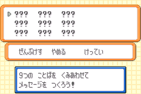

The mail glitch is a glitch that arises from an attempt to give a Pokémon in the party what the game considers the “seventh” party mail. It allows for modifying data in Box 3, Slot 1 as well as item duplication through abusing oversights in the code responsible for giving Pokémon mail.

The purpose of this tutorial is to prepare the mail glitch on your save file, then cover basic use cases for the mail glitch.

## Requirements

*   A Pokémon with the move **Knock Off**.
    +   CH’DING the trade Farfetch’d learns **Knock Off** at level **21**.
*   A Pokémon with the move **Recycle**.
    +   MIMIEN the trade Mr. Mime learns **Recycle** at level **33**.
    +   Porygon learns **Recycle** at level **44**.
*   A consumable item (e.g. a berry).
    +   A **Sitrus Berry** works best as its consumption will trigger at 50% HP.
*   Mail
    +   The only mail that is purchasable in FireRed and LeafGreen is **Retro Mail**, and those cost 50 Pokédollars.
    +   You should buy this in large amounts, preferably at least **one hundred**.

## Preparing the mail glitch

Order the Pokémon in your party as follows:

1. Any Pokémon holding a consumable item.
2. Your Pokémon that knows **Knock Off**.
3. Your Pokémon that knows **Recycle**.
    *   This Pokémon must be holding **mail**, the message on it does not matter.
4. Any Pokémon.
    *   This also applies for slots 5, and 6.

Then move your player character close to **double battle** trainers. Any (including VS Seeker trainers) is fine for our purposes, if you have not battled the double battle trainers yet then make sure to not be within their sightline **yet**. **Save** your game at this point, before performing the next step.

Then **enter** a double battle with the double battle trainers.

Note

If you are planning on obtaining species 0x0351 via corrupting MIMIEN, keep in mind that MIMIEN will gain EVs during this battle if it gains any experience points. For this case, the double battle against Rapidash and Ninetales on Route 16 is preferred. They only give Speed and Sp.Defense EVs which will not affect MIMIEN’S corruption into 0x0351.

Make the Pokémon holding a consumable item **consume** its held item.

Once it consumes its held item, **shift** the Pokémon that knows **Recycle** into its slot. Have the Pokémon that knows **Knock Off** use that move on the incoming Pokémon. The **Knock Off** move should result in the following message.

<samp>\[ \_ \] has knocked off \[ \_ \]’s \[ \_ \] MAIL</samp>

On the next turn, the Pokémon should use **Recycle**. The **Recycle** move should result in the following message, with the found item being the consumed item of the Pokémon that was shifted out.

<samp>\[ \_ \] found one \[ \_ \].</samp>

Finish the double battle. When viewing your party, there should be **no** Pokémon holding a **mail** item. If that is the case, then you have successfully prepared your game for using the mail glitch. Otherwise, you should restart back from your previous save point and try this procedure again.

## Using the mail glitch

Make sure that **Box 3, Slot 1** is **empty** before using the mail glitch unless otherwise instructed.

First, make sure that your party consists of six Pokémon. What the six Pokémon are does not matter for our purposes[^1].

Then give the each member of your party **mail**.

The first five mail should look normal (i.e. all words are empty), and what you enter as their message does not matter. Just <b>ABRA</b> (for non-Japanese FireRed and LeafGreen) or <b>アーボ</b> (for Japanese FireRed and LeafGreen) should suffice.

However on the sixth mail, the contents should look *different*. The mail should consist of <b>???</b> words as shown in the below pictures.

Note

If Box 3, Slot 1 is populated, there may be other words mixed in, but that is normal.

<figure markdown="span">

<figcaption markdown="span">

The glitched mail on English FireRed and LeafGreen.

</figcaption>

</figure>
<figure markdown="span">

<figcaption markdown="span">

The glitched mail on Japanese FireRed and LeafGreen.

</figcaption>

</figure>

Each mail word in the glitched mail corresponds to a piece of Pokémon data in the 1st slot of Box 3 that can be overwritten by writing any mail word (or deleting the <b>???</b>) into that word slot. Confirming the mail message will make the overwriting take place and you should return to the party screen with the message that the Pokémon has been given mail.

As word slots occupied with <b>???</b> are not considered to be empty, you can also confirm the initial glitched message as is, and the data in Box 3, Slot 1 will be left unmodified.

[^1]: If you have not placed the Pokémon that knows **Recycle** in a PC box, or gave mail to it since performing the double battle, then make sure it is not the **last** Pokémon to receive mail while performing the mail glitch if you wish to intentionally corrupt Pokémon data within the boxes. In this case if it is the last Pokémon to receive mail, you will end up having a different looking “sixth” mail that would be just the contents of the initial mail you placed on it before entering the double battle.

### Item duplication

If you have noticed, upon confirming the glitched mail the quantity of mail in your bag decreased, but the Pokémon is not holding the mail. At the same time, the quantity of the Pokémon’s held item (if any) in the bag increases, which allows for item duplication.

To take advantage of this interaction to duplicate items you can simply:

1. Give the Pokémon not holding any mail an item you want to duplicate.
2. Then try to give the Pokémon mail.
3. On the glitched mail screen, simply confirm the glitched mail as is.
4. Repeat this for the amount of new copies you want for that particular item.

You should now see that the amount of the item you want to duplicate increased in the bag.

### Pokémon corruption

In non-Japanese FireRed and LeafGreen, the mail glitch allows modifying the PID and TID of Box 3, Slot 1. While this can just be used for getting ACE, the ability to modify PID and TID also allows for corruptions similar to that of Glitzer Popping. With a Pokémon that has a specific PID and TID, you can use mail glitch to transform it into a completely different Pokémon with the ideal species, moves, and stats. Papa Jefé has a [comprehensive video tutorial](https://youtu.be/3jkcq8e9NO4?t=1805&feature=shared) utilising the mail glitch in this manner.

Unfortunately in Japanese FireRed and LeafGreen, the mail glitch covers an area of the data structure that is more difficult to modify due to needing to account for encryption. As such this usage of the mail glitch in the Japanese games is limited, with it being mainly used for getting ACE in the Japanese games.

## Conclusion

You should now be able to prepare the mail glitch on a save file, and know how to use it for item corruption and for modifying Pokémon data.

## Credits

*   [luckytyphlosion](https://www.youtube.com/channel/UChDv6rpkkaQ143oa-TmIiQQ) for originally discovering this version of the mail glitch.
