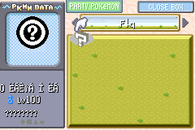

In this tutorial, you will be setting up arbitrary code execution in non-Japanese FireRed or LeafGreen through the PC shift/swap action in the Pokémon Storage System. Through the mail glitch, you will transform an empty slot in the PC into glitch species 0x0351 which is the standard ACE species used in non-Japanese FireRed and LeafGreen.

## Prequisites

*   Your save has the mail glitch active, and you know how to use it.
    +   If not, please read [this article](mail-glitch.md) to learn how to activate it.
*   8 HP Ups
    +   These can be purchased or cloned via the mail glitch.

## Procedure

Make sure that Box 3, Slot 1 is **empty** before you do this.

Then activate the mail glitch, you should see the following screen

<figure markdown="span">


<figcaption markdown="span">

The glitched mail on English FireRed and LeafGreen.

</figcaption>

</figure>

**Set** the message of the glitched mail to be the following.

<table>
    <tbody>
        <tr>
            <th scope="row">English</th>
            <td>
                <table>
                    <tbody>
                        <tr>
                            <td>???</td>
                            <td>HIGHS</td>
                        </tr>
                        <tr>
                            <td>I CHOOSE YOU</td>
                            <td>WANDERING</td>
                        </tr>
                    </tbody>
                </table>
            </td>
        </tr>
        <tr>
            <th scope="row">French</th>
            <td>
                <table>
                    <tbody>
                        <tr>
                            <td>???</td>
                            <td>HAUTEUR</td>
                        </tr>
                        <tr>
                            <td>CE SERA TOI</td>
                            <td>NOMADE</td>
                        </tr>
                    </tbody>
                </table>
            </td>
        </tr>
        <tr>
            <th scope="row">Italian</th>
            <td>
                <table>
                    <tbody>
                        <tr>
                            <td>???</td>
                            <td>SUL SERIO</td>
                        </tr>
                        <tr>
                            <td>FATTI AVANTI</td>
                            <td>CRUDELE</td>
                        </tr>
                    </tbody>
                </table>
            </td>
        </tr>
        <tr>
            <th scope="row">German</th>
            <td>
                <table>
                    <tbody>
                        <tr>
                            <td>???</td>
                            <td>HÖHEN</td>
                        </tr>
                        <tr>
                            <td>DU BIST DRAN</td>
                            <td>LATSCH</td>
                        </tr>
                    </tbody>
                </table>
            </td>
        </tr>
        <tr>
            <th scope="row">Spanish</th>
            <td>
                <table>
                    <tbody>
                        <tr>
                            <td>(?)</td>
                            <td>INFANTIL</td>
                        </tr>
                        <tr>
                            <td>TE ELIJO</td>
                            <td>RIDÍCULO</td>
                        </tr>
                    </tbody>
                </table>
            </td>
        </tr>
    </tbody>
</table>

**Confirm** the message.

After confirming the message, a glitch species should appear in Box 3, Slot 1. This should be species 0x0200. It should have the following characteristics:

*   Species name is one of the following depending on your language:
    <table>
        <tbody>
            <tr>
                <th scope="row">English</th>
                <td><samp>HOCK</samp></td>
            </tr>
            <tr>
                <th scope="row">French</th>
                <td><samp style="white-space: pre">     TONNE</samp></td>
            </tr>
            <tr>
                <th scope="row">Italian</th>
                <td><samp>CK</samp></td>
            </tr>
            <tr>
                <th scope="row">German</th>
                <td><samp>HOCK</samp></td>
            </tr>
            <tr>
                <th scope="row">Spanish</th>
                <td><samp>ENO</samp></td>
            </tr>
        </tbody>
    </table>
*   Level 4
*   Female

If the glitch species does not have the correct name, or a bad egg appeared instead, do the glitched mail message again, and make sure that Box 3, Slot 1 is **empty**.

Move species 0x0200 into your party then give it:

*   **8** HP Ups
    +   This provides **80** HP effort values.
*   **1** **HP** effort value
    +   This can be provided by Caterpie, which can be found in the Viridian Forest.
*   **1** **Attack** effort value
    +   This can be provided by defeating **1** Doduo, which can be found on Route 16.
    +   This can also be provided by defeating **1** Mankey, which can be found on Route 22.

After giving it these EVs, place it back into Box 3, Slot 1.

Activate the mail glitch again, then set the message of the glitched mail to be the following:

<div class="admonition note" markdown="block">
<p class="admonition-title">Note</p>

You will see the message that you have entered in the first glitched mail. This is completely normal, and is intended.

The words entered for this message are the same, but the position of the second and fourth words have been swapped. You do not need to re-enter the first or third words.

</div>

<table>
    <tbody>
        <tr>
            <th scope="row">English</th>
            <td>
                <table>
                    <tbody>
                        <tr>
                            <td>???</td>
                            <td>WANDERING</td>
                        </tr>
                        <tr>
                            <td>I CHOOSE YOU</td>
                            <td>HIGHS</td>
                        </tr>
                    </tbody>
                </table>
            </td>
        </tr>
        <tr>
            <th scope="row">French</th>
            <td>
                <table>
                    <tbody>
                        <tr>
                            <td>???</td>
                            <td>NOMADE</td>
                        </tr>
                        <tr>
                            <td>CE SERA TOI</td>
                            <td>HAUTEUR</td>
                        </tr>
                    </tbody>
                </table>
            </td>
        </tr>
        <tr>
            <th scope="row">Italian</th>
            <td>
                <table>
                    <tbody>
                        <tr>
                            <td>???</td>
                            <td>CRUDELE</td>
                        </tr>
                        <tr>
                            <td>FATTI AVANTI</td>
                            <td>SUL SERIO</td>
                        </tr>
                    </tbody>
                </table>
            </td>
        </tr>
        <tr>
            <th scope="row">German</th>
            <td>
                <table>
                    <tbody>
                        <tr>
                            <td>???</td>
                            <td>LATSCH</td>
                        </tr>
                        <tr>
                            <td>DU BIST DRAN</td>
                            <td>HÖHEN</td>
                        </tr>
                    </tbody>
                </table>
            </td>
        </tr>
        <tr>
            <th scope="row">Spanish</th>
            <td>
                <table>
                    <tbody>
                        <tr>
                            <td>(?)</td>
                            <td>RIDÍCULO</td>
                        </tr>
                        <tr>
                            <td>TE ELIJO</td>
                            <td>INFANTIL</td>
                        </tr>
                    </tbody>
                </table>
            </td>
        </tr>
    </tbody>
</table>

**Confirm** the message.

After confirming this message, check Box 3, Slot 1. The 0x0200 should have become species 0x0351, which should have a name like <samp>ËÁÈî ΠËÁ</samp>, level 100, and is male as shown in the image below. If you see this, that means you have successfully setup ACE! Continue reading to learn how to trigger ACE with this Pokémon.



<div class="admonition note" markdown="block">
<p class="admonition-title">Note</p>

Before triggering any kind of ACE, make sure that:

*   Done all prerequisite steps for that particular code (e.g. created specific bootstraps, in correct location, etc.)
*   You have changed the box names to the ones for your code. Make sure that you have entered these codes correctly!
*   The entrypoint (Box 13, Slot 7) and all spaces after it are **empty**.
    +   If the Pokémon occupying these spaces are bootstrap Pokémon (Pokémon containing special data for various ACE setups to use), they should be fine occupying these spaces as long as they are for the form of ACE you are using (the covered form in this tutorial is **grab/swap** ACE).

</div>

To trigger ACE with this Pokémon, in the PC’s **Move Pokémon** mode, grab any Pokémon (except for the glitch Pokémon), and make sure the cursor is **orange** (press <kbd>SELECT</kbd> if it is not). Then swap this Pokémon with the glitch Pokémon by hovering it over the glitch Pokémon then pressing <kbd>A</kbd>. This should move the glitch Pokémon into the cursor, press <kbd>A</kbd> again and the other Pokémon should come back into the cursor. Place this Pokémon anywhere afterwards.


## Checking if everything worked

Make sure that Box 10, Slot 19 is **empty**, then set your box names to the ones shown below.

```
Box  1: 4 C U n n R … o	[4CUnnR…o]
Box  2: P R o / F w m _	[PRo/Fwm ]
Box  3: _ _ V H . o _ _	[  VH.o  ]
Box  4: _ … H R n _ _ _	[ …HRn   ]
Box  5: / F Q m D F Q m	[/FQmDFQm]
Box  6: _ _ _ _ _ _ … _	[      … ]
Box  7: _ _ _ _ _ … _ _	[     …  ]
Box  8: _ _ _ _ … _ _ _	[    …   ]
Box  9: _ _ _ … _ _ _ _	[   …    ]
Box 10: _ _ _ _ _ … o a	[     …oa]
Box 11: … o _ _ _ _ _ _	[…o      ]
```

Then trigger ACE. Then enter the PC, and view Box 10, Slot 19, a shiny, level 0, female Bulbasaur should have appeared. That means the ACE is working properly. You can safely delete this Bulbasuar after doing this code.
