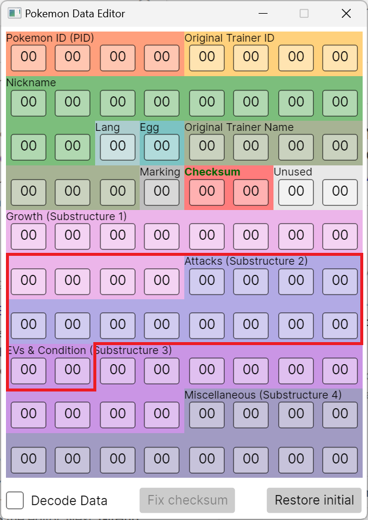

## How does mail glitch work?

To quickly explain why Japanese FireRed and LeafGreen mail glitch works slightly differently to non-Japanese FireRed and LeafGreen, we will need to talk about how the mail glitch works overall.

In Pokémon FireRed and LeafGreen mail data is structured as follows (courtesy of [pret][pret_pokefirered_mail_struct]):

*   Nine 16-bit values representing the words composing the mail message.
*   The sender’s name, which is an seven character long string with a terminator appended at the end.
*   The sender’s trainer ID, which is a 16-bit value
*   A 16-bit value representing the species of the Pokémon that is holding the mail (if any)
*   A 16-bit value representing the item the mail is associated with

As this data is stored in a struct, these will all start at a word-aligned address (i.e. divisible by four).
Mails are all stored together in an [array][pret_pokefirered_mail_array] in `SaveBlock1`.

The mail glitch works by setting up a state where the number of occupied party mail slots is greater than the number of party Pokémon holding mail (usually only by one).
Normally mail should not be able to be removed as a held item from a Pokémon without updating the mail’s associated slot, but in all generation III games, Knock Off and Recycle allows for the removal of mail as a held item without updating the mail slot the mail is associated with, recreating this state.

After setting up this state, we fill up the rest of the party mail slots, and because of this misalignment, there will be still party Pokémon not holding mail.
When we attempt to give these Pokémon mail, the code that tries to [initialise][pret_pokefirered_give_mail_to_mon] (and assign an ID to) the mail to give to the party Pokémon fails because the party mail slots are all “full”.
Despite this, the [code][pret_pokefirered_cb2_writemail] for writing the mail will still run, where it grabs the target mail ID to write to from the mail ID stored in the target Pokémon’s data structure, and writes the words for the “mail” there.
By default, the mail ID stored in the data structure is mail 255 (0xFF) as that is the constant for “no mail”, so the “mail slot” being written to is slot 255[^1].

The location of mail slot 255 is what makes Japanese FireRed and LeafGreen mail glitch slightly different from non-Japanese FireRed and LeafGreen.
In non-Japanese FireRed and LeafGreen games, mail slot 255 starts at the PID of the first slot of box 3.
In the Japanese games, mail slot 255 starts 40 bytes within the first slot of box 3. The below image illustrates the area of the data structures that is written to by the mail glitch.

{ width="300px" }

What this means is that non-Japanese setups will not work on Japanese versions as they rely on changing the PID/TID to adjust the substructure order or the encryption key to get the ACE Pokémon, which cannot be done in Japanese versions.
Instead the Japanese ACE setups will instead aim to replace the species ID within the growth substructure to be the value of an ACE species, as well as another value (usually experience or effort values depending on the substructure order) to preserve the existing checksum.
This is done through providing a donor Pokémon we will modify, where we already know the PID, and the trainer ID of the original trainer (we do not need to know the secret ID).

[pret_pokefirered_mail_struct]: https://github.com/pret/pokefirered/blob/d61f9594532a7b3eb53f97d1b40ed99b955128c0/include/global.h#L513
[pret_pokefirered_give_mail_to_mon]: https://github.com/pret/pokefirered/blob/d61f9594532a7b3eb53f97d1b40ed99b955128c0/src/mail_data.c#L41
[pret_pokefirered_mail_array]: https://github.com/pret/pokefirered/blob/d61f9594532a7b3eb53f97d1b40ed99b955128c0/include/global.h#L787
[pret_pokefirered_cb2_writemail]: https://github.com/pret/pokefirered/blob/master/src/party_menu.c#L3535

[^1]:
    If let the Pokémon that got its mail removed via Knock Off be the last one to receive mail, this may not be the case.
    This is because the mail ID of the mail that is removed is still in the data structure, meaning you will end up writing to the original mail that got removed rather than slot 255 which is unwanted.

## Personality value

There are two important characteristics that determine how a Pokémon’s data is interpreted, the substructure order and the encryption key.

### Substructure order

The substructure order is the determined by the result of personality value modulo 24, where the table below shows how each of the substructures (**G**rowth, **A**ttacks, **E**Vs and Condition, and **M**iscellaneous) would be ordered (courtesy of [Bulbapedia][bulbapedia_data_substructures]).

<table>
    <tr>
        <td>00. GAEM</td>
        <td>06. AGEM</td>
        <td>12. EGAM</td>
        <td>18. MGAE</td>
    </tr>
    <tr>
        <td>01. GAME</td>
        <td>07. AGME</td>
        <td>13. EGMA</td>
        <td>19. MGEA</td>
    </tr>
    <tr>
        <td>02. GEAM</td>
        <td>08. AEGM</td>
        <td>14. EAGM</td>
        <td>20. MAGE</td>
    </tr>
    <tr>
        <td>03. GEMA</td>
        <td>09. AEMG</td>
        <td>15. EAMG</td>
        <td>21. MAEG</td>
    </tr>
    <tr>
        <td>04. GMAE</td>
        <td>10. AMGE</td>
        <td>16. EMGA</td>
        <td>22. MEGA</td>
    </tr>
    <tr>
        <td>05. GMEA</td>
        <td>11. AMEG</td>
        <td>17. EMAG</td>
        <td>23. MEAG</td>
    </tr>
</table>

[bulbapedia_data_substructures]: https://bulbapedia.bulbagarden.net/wiki/Pok%C3%A9mon_data_substructures_(Generation_III)

As established earlier, mail slot 255 starts in the middle of substructures data of the first slot of box 3.
Using this fact, we find out that we can use the mail glitch to replace the value of the species field (a 16-bit value) with our own one.
However in order to do this, we will need a substructure order where the species field is located within the “words” area of mail slot 255.
This leaves all substructure orders with growth as the second or third substructure.
However we will also need some way to modify the value of a different field to correct for the difference from the original checksum, to ensure that the donor Pokémon does not become a bad egg.
Stats that are relatively easy to adjust in FR/LG are experience, and effort values.
After this, the substructure orders that would work for this setup is all of the orders with growth as the second substructure, as well as substructure orders with EVs as the second substructure and growth as the third substructure.

### Encryption key

Encryption key is the value used to encrypt the four substructures (Growth, Attacks, EVs, and Miscellaneous) of a Pokémon’s data. Given:

<dl markdown>
<dt><var>ID<sub>Trainer</sub></var></dt>
<dd markdown>

The trainer’s ID number (more commonly referred to as the trainer ID).

</dd>
<dt><var>ID<sub>Secret</sub></var></dt>
<dd markdown>

The trainer’s second unseen ID number (more commonly referred to as the secret ID).

</dd>
<dt><var>p</var></dt>
<dd markdown>

The personality value of the Pokémon.

</dd>
</dl>

Then the encryption key  
<var>E</var> = <var>ID<sub>Trainer</sub></var> + (<var>ID<sub>Secret</sub></var> &sdot; 65536) &oplus; <var>p</var>

For this setup, the upper 16 bits of the encryption key do not matter (and from here on, the “encryption key” will only refer to the lower 16 bits of the key), this is because species is encrypted by the lower 16 bits of the encryption key, and the values that are used to correct for the checksum difference are also encrypted with the lower 16 bits of the encryption key.
This allows for ignoring the secret ID which is unknown in “normal” gameplay, and can only be known either through direct RNG manipulation (very difficult, as the RNG for this is seeded through a very fast CPU timer), [deduction][blisy_sid_deduction_process] through RNG manipulation (less difficult), arbitrary code execution (unlikely to have access if you are doing this setup at the moment), or using a save editor (requires external tools).

This setup also requires that the encryption key XORed with any species ID on [the list][it_is_final_fr_ace_speices] of ACE species (this one is for FireRed, but there is a LeafGreen one in the same folder) must equal to a word ID (which we call the species word) on the [mail words list][it_is_final_jpn_easy_chat].
This is so that the desired species ID can be written in with a mail word (otherwise the whole setup would not work at all).
With the relatively large list of ACE species, that allows for this technique to be somewhat viable without using RNG manipulation to guarantee a donor Pokémon with a compatible personality value.

[blisy_sid_deduction_process]: https://www.youtube.com/watch?v=LFBbfr5-asc
[it_is_final_jpn_easy_chat]: https://github.com/it-is-final/jpn-frlg-helper/blob/33d5f6be990a52c67aaf98e4c3dbd484dda340f4/jpn_frlg_helper/resources/easy_chat.csv
[it_is_final_fr_ace_speices]: https://github.com/it-is-final/jpn-frlg-helper/blob/33d5f6be990a52c67aaf98e4c3dbd484dda340f4/jpn_frlg_helper/resources/firered.csv

## Checksum correction

While we could try simply replacing the old species value with the new species value, due the difference between the old species ID and the new species ID the donor Pokémon will become a bad egg if we do not adjust another value to correct for the checksum (ideally with another mail word).
The chances of there being another mail word that can immediately correct for the checksum difference is low, so usually the (lower 16 bits of) experience (with substructure orders that have growth as the second substructure) or the HP-Attack/Sp.Attack-Sp.Defense effort values (with substructure orders that have EVs as the second substructure, and growth as the third substructure) are adjusted to specific values so that when replaced by a mail word along with the species ID, the checksum difference is accounted for and the resulting species is still considered a valid Pokémon.

First we choose *any* mail word to correct the checksum with (we call this the checksum word).
Then we use this formula to calculate the adjustment value:

```
checksum_difference ← new_species_id - base_species_id
decrypted_value     ← encryption_key ^ checksum_word_id
adjustment          ← (checksum_difference + decrypted_value) mod 65536
```

Where:

*   `^` is the bitwise XOR operator

With this adjustment value, this is how it can be applied to experience:

```
experience mod 65536 = adjustment
```

And for the HP-Attack/Sp.Attack-Sp.Defense effort values, first of all let HP or Sp.Attack be effort value 1, and Attack or Sp.Defense be effort value 2, then apply the following math:

```
effort_value_1 = adjustment mod 256
effort_value_2 = floor(adjustment / 256)
```

Where:

*   `floor` is round down towards negative infinity (or simply just round down since we are not dealing with negative numbers)

Keep in mind that HP and Attack, and Sp.Attack and Sp.Defense must be adjusted together as a pair, parts of one pair cannot be mixed with another.

After we have adjusted either of these stats to these values, on mail write, we will simply replace the equivalent word located on the stats we have adjusted with the checksum word (for experience we are replacing the lower 16 bits), along with the species word replacing the species value with the species word and the donor Pokémon will become the glitch species that we were targeting for.

## Initial ACE code

This is analogous to most non-Japanese Emerald stable ACE setups using species 0x0611 to generate a stable ACE species (and maybe also set up a `BX r0` in box 14 for the Thumb→ARM bootstrap code), as the intermediate ACE species (of which there are many) that can be generated right away with this set up have quite a bit of variation.

These variations can include:

*   Strange graphical glitches (e.g. screen turns black) upon loading the name of these species
*   Different mode of execution within the boxes (ARM vs Thumb)
*   Differing entrypoints within the boxes

To keep an consistent ACE environment that can be used without worrying about the specifics of each glitch Pokémon, the Japanese glitching community has centred on one glitch species to become the main ACE species for Japanese FireRed and LeafGreen: 0xFFC9.
This species triggers ACE in Thumb mode, and has an entrypoint around the 29th slot of box 12.

The code that creates this species in party slot 3 is below:

```
Box  1:	リ び … ｏ く ＿ ゼ ｎ	[リび…ｏく　ゼｎ]
Box  2:	＿ … ｔ ま ＿ １ ｔ ほ	[　…ｔま　１ｔほ]
Box  3:	ぁ ｍ ＿ ＿ あ い 　 　	[ぁｍ　　あい]
Box  4:	ア Ｂ ぢ い い Ｎ 　 　	[アＢぢいいＮ]
Box  5:	Ｏ 　 　 　 　 　 　 　	[Ｏ]
```

And below are the assembly instructions that comprise the code:

```
            .thumb                  ; acts as a filler in ARM mode
4778        BX      pc              ; Switch to ARM (for Thumb Pokémon), easier to switch to ARM than the other way around
E3B0        ; (filler)
            .arm
E28F0008    ADD     r0, pc, #0x8
E8B000FF    LDMIA   r0!, {r0-r7}
E8A2001F    STMIA   r2!, {r0-r4}
E12FFF1E    BX      lr
02010000    ; hasSpecies set, language = Japanese, r0 false return
51FFFFFF    ; (filler)
020242BC    ; Address of party slot 3, at nickname chars 8-9, lang and egg flags
FFFFFFC8    ; Checksum and unused data
FFFFFFC9    ; Species and held item
```

## Conclusion, Credits and Acknowledgements

That is the technical explanation for the Japanese arbitrary code execution setup.

While the math behind this is relatively simple, there is a reason why that tools were made to automate this part of this process (in particular finding a donor Pokémon with the correct personality value, and the checksum word process).
For the personality value, it would be a long process of checking the substructure order first, then checking the XOR against the whole list of ACE species and mail words to make sure that it is compatible with this setup (which often times is not).
And the checksum word tool can probably find more efficient words (in terms of experience, or EV training) to use as checksum words.

Below are the people or groups that has helped with this in some way.

*   [luckytyphlosion][luckytyphlosion_github] for discovering mail glitch, and PC swap/grab ACE in Pokémon FireRed and LeafGreen.
*   [merrp][merrp_youtube] for initially handling the exploitation of these new glitches, and creating the initial setup for PC swap/grab ACE in non-Japanese FireRed and LeafGreen.
    +   [FireRed/LeafGreen Birth Island Warp via 0x351 Grab ACE][merrp_frlg_demo]: the original demonstration video for PC swap/grab ACE.
*   [Detelony (デテロニー)][detelony_youtube] for creating the setup for PC swap/grab ACE in Japanese FireRed and LeafGreen.
    +   [【任意コード実行】ポケモン ファイアレッド ･リーフグリーン 新発見されたバグを使用して任意コード実行【解説】][detelony_jpn_tutorial]: their tutorial for PC swap/grab ACE in Japanese FireRed and LeafGreen.
*   [pret][pret_github] for their decompilations which allows understanding of the game’s code in a more familar manner.
    +   [pokefirered][pret_pokefirered]: decompilation for Pokémon FireRed and LeafGreen.
*   [Adrichu00][adrichu00_github] for tracking down the code responsible for the mail glitch.
*   [Bulbapedia][bulbapedia] for the pages on the Pokémon data structure and substructures.

[luckytyphlosion_github]: https://github.com/luckytyphlosion
[merrp_youtube]: https://www.youtube.com/@pokemerrp
[merrp_frlg_demo]: https://www.youtube.com/watch?v=yVhK4pLC9ac
[detelony_youtube]: https://www.youtube.com/@detelony
[detelony_jpn_tutorial]: https://www.youtube.com/watch?v=i9d4AyI2l1A
[pret_github]: https://github.com/pret
[pret_pokefirered]: https://github.com/pret/pokefirered
[adrichu00_github]: https://github.com/adrichu00
[bulbapedia]: https://bulbapedia.bulbagarden.net/wiki/
